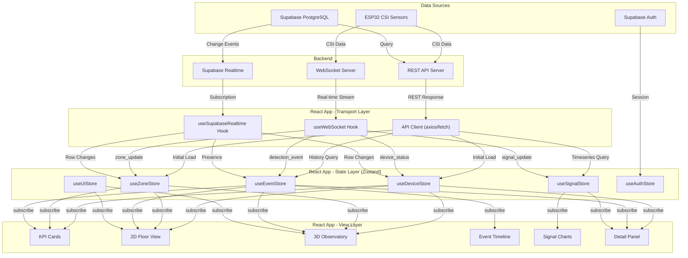

# Q2 React 메인 관제 UI 설계서

> **프로젝트**: RuView — 오픈소스 기반 CSI 재실/낙상 감지 서비스 MVP
> **기술 스택**: React 18 + Vite + TypeScript + Tailwind CSS + shadcn/ui + Zustand
> **2D Floor**: SVG (1차) / Konva (2차 확장)
> **3D Observatory**: RuView 내장 Three.js iframe bridge (1차) → React Three Fiber (2차)
> **실시간 데이터**: WebSocket + Supabase Realtime
> **작성일**: 2026-03-18
> **버전**: 1.0.0

---

## 목차

1. [정보 구조 (Information Architecture)](#1-정보-구조-information-architecture)
2. [메인 대시보드 레이아웃 설계](#2-메인-대시보드-레이아웃-설계)
3. [컴포넌트 트리 (Component Tree)](#3-컴포넌트-트리-component-tree)
4. [상태 관리 설계 (State Management)](#4-상태-관리-설계-state-management)
5. [데이터 흐름 (Data Flow)](#5-데이터-흐름-data-flow)
6. [2D Floor View 상세 설계](#6-2d-floor-view-상세-설계)
7. [3D Observatory 통합 설계](#7-3d-observatory-통합-설계)
8. [실시간 데이터 바인딩 구조](#8-실시간-데이터-바인딩-구조)
9. [테슬라형 UI 디자인 시스템](#9-테슬라형-ui-디자인-시스템)
10. [TypeScript 타입 정의](#10-typescript-타입-정의)

---

## 1. 정보 구조 (Information Architecture)

### 1.1 전체 페이지 맵 (라우팅 구조)

```
/                           → 로그인/랜딩 (미인증 시)
/dashboard                  → 메인 관제 대시보드 (기본 홈)
/dashboard/floor/:floorId   → 특정 층 2D 플로어 전체화면
/dashboard/observatory      → 3D Observatory 전체화면
/devices                    → 디바이스 관리 목록
/devices/:deviceId          → 디바이스 상세/설정
/devices/:deviceId/signal   → 디바이스 신호 분석 뷰
/zones                      → 존(Zone) 관리 목록
/zones/:zoneId              → 존 상세 (커버리지, 이벤트 히스토리)
/zones/:zoneId/edit         → 존 편집 (폴리곤 드로잉)
/events                     → 이벤트 히스토리 (전체 타임라인)
/events/:eventId            → 이벤트 상세 (컨텍스트, 리플레이)
/alerts                     → 알림 관리
/alerts/rules               → 알림 규칙 설정
/analytics                  → 통계/분석 대시보드
/analytics/occupancy        → 재실 패턴 분석
/analytics/incidents        → 낙상/이상 감지 분석
/settings                   → 시스템 설정
/settings/users             → 사용자 관리
/settings/integrations      → 외부 연동 설정
/settings/floor-plans       → 평면도 관리/업로드
/settings/system            → 시스템 환경 설정
```

React Router v6 기반 라우트 설정:

```typescript
// src/router/index.tsx
const router = createBrowserRouter([
  {
    path: '/',
    element: <RootLayout />,
    errorElement: <ErrorBoundary />,
    children: [
      { index: true, element: <Navigate to="/dashboard" replace /> },
      {
        path: 'dashboard',
        element: <DashboardLayout />,
        children: [
          { index: true, element: <MainDashboard /> },
          { path: 'floor/:floorId', element: <FloorFullscreen /> },
          { path: 'observatory', element: <ObservatoryFullscreen /> },
        ],
      },
      {
        path: 'devices',
        element: <DevicesLayout />,
        children: [
          { index: true, element: <DeviceList /> },
          { path: ':deviceId', element: <DeviceDetail /> },
          { path: ':deviceId/signal', element: <SignalAnalysis /> },
        ],
      },
      {
        path: 'zones',
        element: <ZonesLayout />,
        children: [
          { index: true, element: <ZoneList /> },
          { path: ':zoneId', element: <ZoneDetail /> },
          { path: ':zoneId/edit', element: <ZoneEditor /> },
        ],
      },
      {
        path: 'events',
        element: <EventsLayout />,
        children: [
          { index: true, element: <EventTimeline /> },
          { path: ':eventId', element: <EventDetail /> },
        ],
      },
      {
        path: 'alerts',
        element: <AlertsLayout />,
        children: [
          { index: true, element: <AlertDashboard /> },
          { path: 'rules', element: <AlertRules /> },
        ],
      },
      {
        path: 'analytics',
        element: <AnalyticsLayout />,
        children: [
          { index: true, element: <AnalyticsOverview /> },
          { path: 'occupancy', element: <OccupancyAnalytics /> },
          { path: 'incidents', element: <IncidentAnalytics /> },
        ],
      },
      {
        path: 'settings',
        element: <SettingsLayout />,
        children: [
          { index: true, element: <Navigate to="system" replace /> },
          { path: 'users', element: <UserManagement /> },
          { path: 'integrations', element: <Integrations /> },
          { path: 'floor-plans', element: <FloorPlanManager /> },
          { path: 'system', element: <SystemSettings /> },
        ],
      },
    ],
  },
  {
    path: '/login',
    element: <LoginPage />,
  },
  {
    path: '/forgot-password',
    element: <ForgotPassword />,
  },
]);
```

### 1.2 각 페이지별 목적, 사용자 시나리오, 필요 데이터

| 페이지 | 목적 | 사용자 시나리오 | 필요 데이터 |
|--------|------|----------------|-------------|
| **메인 대시보드** | 전체 시설 실시간 모니터링 허브 | 관제사가 한 눈에 전체 시설의 재실/이상 상태를 파악 | devices[], zones[], events[], signals[], alerts[] (실시간) |
| **2D 플로어 전체화면** | 특정 층의 상세 공간 모니터링 | 특정 층에서 이상 감지 시 확대하여 정확한 위치 파악 | floorPlan, devices[filtered], zones[filtered], persons[filtered] |
| **3D Observatory** | 건물 전체의 3차원 시각적 감시 | 다층 건물의 전체 상태를 입체적으로 파악 | building3DModel, devices[], zones[], events[] (실시간) |
| **디바이스 목록** | ESP32/CSI 센서 자산 관리 | 디바이스 추가/제거, 상태 확인, 펌웨어 업데이트 | devices[], deviceStats[] |
| **디바이스 상세** | 개별 디바이스 상세 정보 및 설정 | 특정 디바이스의 신호 품질/설정 조정 | device, signals[timeseries], config |
| **존 관리** | 감지 영역 설정 및 관리 | 새로운 모니터링 존 생성, 기존 존 수정 | zones[], floorPlans[], deviceCoverage[] |
| **존 편집** | 폴리곤 기반 존 영역 드로잉 | 마우스로 존 경계 폴리곤을 그리고 디바이스 할당 | floorPlan, zone, devices[available] |
| **이벤트 타임라인** | 과거 이벤트 히스토리 조회 | 특정 시간대 이벤트 검색, 패턴 분석 | events[paginated], filters |
| **이벤트 상세** | 개별 이벤트 컨텍스트 확인 | 낙상 이벤트의 전후 맥락 파악, 오탐 검증 | event, relatedEvents[], signals[context], snapshots[] |
| **알림 관리** | 알림 설정 및 이력 관리 | 알림 규칙 생성, 알림 이력 확인, 에스컬레이션 설정 | alerts[], alertRules[], notificationChannels[] |
| **통계/분석** | 장기 데이터 기반 분석 | 재실 패턴, 낙상 빈도, 디바이스 가동률 분석 | aggregatedStats[], timeseries[], reports[] |
| **사용자 관리** | 시스템 사용자 계정 관리 | 관리자가 사용자 추가/권한 변경 | users[], roles[] |
| **시스템 설정** | 글로벌 시스템 파라미터 설정 | 감지 임계값, 알림 채널, 데이터 보존 기간 조정 | systemConfig, thresholds[] |

### 1.3 네비게이션 계층 구조

```
[RuView 로고]
│
├── 대시보드 (Dashboard)          ← 메인 GNB, 기본 랜딩
│   ├── 플로어 뷰 (Floor View)     ← 대시보드 내 탭/선택
│   └── 3D 뷰 (Observatory)       ← 대시보드 내 탭/선택
│
├── 디바이스 (Devices)             ← GNB 2번째
│   └── 디바이스 상세               ← 목록 클릭 진입
│       └── 신호 분석               ← 상세 내 탭
│
├── 존 (Zones)                     ← GNB 3번째
│   └── 존 상세                     ← 목록 클릭 진입
│       └── 존 편집                 ← 상세 내 편집 버튼
│
├── 이벤트 (Events)                ← GNB 4번째
│   └── 이벤트 상세                 ← 타임라인 클릭 진입
│
├── 알림 (Alerts)                  ← GNB 5번째
│   └── 알림 규칙                   ← 알림 내 탭
│
├── 분석 (Analytics)               ← GNB 6번째
│   ├── 재실 분석                   ← 분석 내 탭
│   └── 사건 분석                   ← 분석 내 탭
│
└── 설정 (Settings)                ← GNB 하단/아이콘
    ├── 시스템                     ← 설정 내 사이드 탭
    ├── 사용자                     ← 설정 내 사이드 탭
    ├── 연동                       ← 설정 내 사이드 탭
    └── 평면도                     ← 설정 내 사이드 탭
```

**네비게이션 UI 패턴:**
- **GNB (Global Navigation Bar)**: 좌측 사이드바, 축소 가능 (아이콘 모드)
- **LNB (Local Navigation Bar)**: 각 섹션 내 상단 탭 또는 서브 사이드바
- **Breadcrumb**: 상단 헤더에 경로 표시 (대시보드 > 디바이스 > ESP32-001)
- **Quick Actions**: 상단 우측 커맨드 팔레트 (Cmd+K)

### 1.4 권한별 접근 범위

| 역할 (Role) | 대시보드 | 디바이스 | 존 | 이벤트 | 알림 | 분석 | 설정 |
|-------------|---------|---------|---|--------|------|------|------|
| **super_admin** | 전체 R/W | 전체 R/W | 전체 R/W | 전체 R/W | 전체 R/W | 전체 R | 전체 R/W |
| **admin** | 전체 R/W | 전체 R/W | 전체 R/W | 전체 R/W | 전체 R/W | 전체 R | 시스템/연동 제외 R/W |
| **operator** | 전체 R | R only | R only | 전체 R/W | R/W (규칙 제외) | 전체 R | 접근 불가 |
| **viewer** | 전체 R | R only | R only | R only | R only | 전체 R | 접근 불가 |
| **api_service** | API only | API R/W | API R/W | API R/W | API only | API only | 접근 불가 |

권한 체크 구현:

```typescript
// src/lib/permissions.ts
export type Role = 'super_admin' | 'admin' | 'operator' | 'viewer' | 'api_service';

export type Permission =
  | 'dashboard:read'
  | 'devices:read' | 'devices:write' | 'devices:delete'
  | 'zones:read' | 'zones:write' | 'zones:delete'
  | 'events:read' | 'events:write' | 'events:acknowledge'
  | 'alerts:read' | 'alerts:write' | 'alerts:rules'
  | 'analytics:read'
  | 'settings:users' | 'settings:system' | 'settings:integrations' | 'settings:floorplans';

const ROLE_PERMISSIONS: Record<Role, Permission[]> = {
  super_admin: ['*'] as any, // 모든 권한
  admin: [
    'dashboard:read', 'devices:read', 'devices:write', 'devices:delete',
    'zones:read', 'zones:write', 'zones:delete',
    'events:read', 'events:write', 'events:acknowledge',
    'alerts:read', 'alerts:write', 'alerts:rules',
    'analytics:read',
    'settings:users', 'settings:floorplans',
  ],
  operator: [
    'dashboard:read', 'devices:read', 'zones:read',
    'events:read', 'events:write', 'events:acknowledge',
    'alerts:read', 'alerts:write',
    'analytics:read',
  ],
  viewer: [
    'dashboard:read', 'devices:read', 'zones:read',
    'events:read', 'alerts:read', 'analytics:read',
  ],
  api_service: [
    'devices:read', 'devices:write',
    'zones:read', 'zones:write',
    'events:read', 'events:write',
  ],
};

export function hasPermission(role: Role, permission: Permission): boolean {
  const permissions = ROLE_PERMISSIONS[role];
  if ((permissions as any).includes('*')) return true;
  return permissions.includes(permission);
}
```

라우트 가드 컴포넌트:

```typescript
// src/components/auth/ProtectedRoute.tsx
interface ProtectedRouteProps {
  permission: Permission;
  children: React.ReactNode;
  fallback?: React.ReactNode;
}

export function ProtectedRoute({ permission, children, fallback }: ProtectedRouteProps) {
  const { user } = useAuthStore();
  if (!user) return <Navigate to="/login" replace />;
  if (!hasPermission(user.role, permission)) {
    return fallback ?? <AccessDenied />;
  }
  return <>{children}</>;
}
```

---

## 2. 메인 대시보드 레이아웃 설계

### 2.1 그리드 시스템

12-column CSS Grid 기반. Tailwind CSS의 grid 유틸리티 활용.

```
┌──────────────────────────────────────────────────────────────────────┐
│ HEADER BAR (h-14, fixed top)                                         │
│ [Logo] [Breadcrumb]              [Search] [Notifications] [Profile]  │
├────┬─────────────────────────────────────────────────────────────────┤
│    │ KPI CARDS (h-24, grid-cols-4, gap-4, px-6, py-4)                │
│ S  │ ┌──────┐ ┌──────┐ ┌──────┐ ┌──────┐                            │
│ I  │ │Online│ │Active│ │Presn.│ │Crit. │                            │
│ D  │ │Devs  │ │Zones │ │Count │ │Alerts│                            │
│ E  │ └──────┘ └──────┘ └──────┘ └──────┘                            │
│    ├─────────────────────────────────────────┬───────────────────────┤
│ B  │ 2D FLOOR VIEW (col-span-7)              │ 3D OBSERVATORY        │
│ A  │                                         │ (col-span-5)          │
│ R  │  ┌─────────────────────────────────┐    │ ┌───────────────────┐ │
│    │  │                                 │    │ │                   │ │
│ (  │  │     SVG/Konva Canvas            │    │ │  Three.js iframe  │ │
│ w  │  │     - Floor plan                │    │ │  - 3D Building    │ │
│ -  │  │     - Zones (polygon)           │    │ │  - Device markers │ │
│ 5  │  │     - Devices (markers)         │    │ │  - Event effects  │ │
│ 6  │  │     - People (dots)             │    │ │                   │ │
│ )  │  │     - Events (pulses)           │    │ │                   │ │
│    │  │                                 │    │ │                   │ │
│    │  └─────────────────────────────────┘    │ └───────────────────┘ │
│    │  [Floor selector] [Layer toggles]       │ [View controls]       │
│    ├──────────────────────┬──────────────────┴───────────────────────┤
│    │ EVENT TIMELINE       │ SIGNAL / VITAL CHARTS                    │
│    │ (col-span-5)         │ (col-span-7)                             │
│    │ ┌──────────────────┐ │ ┌──────────────────────────────────────┐ │
│    │ │ 14:32 fall_susp  │ │ │ ~~~~ RSSI Signal Chart ~~~~~~~~~~~~ │ │
│    │ │ 14:31 presence   │ │ │ ~~~~ CSI Amplitude Chart ~~~~~~~~~ │ │
│    │ │ 14:30 motion     │ │ │ ~~~~ Activity Heatmap ~~~~~~~~~~~~ │ │
│    │ │ 14:29 stationary │ │ │                                    │ │
│    │ │ ...              │ │ │ [1H] [6H] [24H] [7D]              │ │
│    │ └──────────────────┘ │ └──────────────────────────────────────┘ │
│    │ [Filter] [Export]    │ [Device selector] [Metric selector]      │
└────┴──────────────────────┴─────────────────────────────────────────┘
```

### 2.2 상세 영역 설계

#### 2.2.1 헤더 바 (Header Bar)

- **높이**: `h-14` (56px)
- **위치**: `fixed top-0`, `z-50`
- **배경**: `bg-slate-950/95 backdrop-blur-sm border-b border-slate-800`
- **좌측**: RuView 로고 (32x32) + Breadcrumb
- **중앙**: 글로벌 검색 (Cmd+K 트리거, shadcn/ui `CommandDialog`)
- **우측**:
  - 알림 벨 아이콘 + 배지 (미확인 알림 수)
  - 연결 상태 인디케이터 (WebSocket 연결/해제)
  - 사용자 아바타 + 드롭다운 (프로필, 설정, 로그아웃)

#### 2.2.2 좌측 사이드바 (Sidebar)

- **너비**: 펼침 `w-56` (224px), 축소 `w-14` (56px)
- **애니메이션**: `transition-all duration-300 ease-in-out`
- **구성**:
  - 상단: 네비게이션 아이콘 + 레이블
  - 하단: 설정/도움말/축소 토글
- **상태**: `useUIStore`의 `sidebarCollapsed` 값으로 제어

#### 2.2.3 KPI 카드 영역

4개 카드, 동일 크기, `grid-cols-4 gap-4`:

| 카드 | 메인 숫자 | 서브 텍스트 | 아이콘 | 트렌드 | 색상 |
|------|----------|------------|--------|--------|------|
| **Online Devices** | `12/15` | "3 offline" | `Cpu` | 지난 1H 대비 | 정상: cyan, 경고: amber |
| **Active Zones** | `8` | "2 intrusion" | `MapPin` | 활성 존 변화 | 정상: emerald, 경고: rose |
| **Presence Count** | `23` | "5 stationary" | `Users` | 지난 1H 대비 | 정상: violet, 경고: amber |
| **Critical Alerts** | `2` | "1 fall_suspected" | `AlertTriangle` | 미확인 알림 | 0: emerald, >0: rose pulse |

카드 내부 구조:

```typescript
interface KPICardProps {
  title: string;
  value: string | number;
  subtitle: string;
  icon: LucideIcon;
  trend?: { value: number; direction: 'up' | 'down' | 'flat' };
  status: 'normal' | 'warning' | 'critical';
  onClick?: () => void;
}
```

#### 2.2.4 중앙 좌측: 2D 플로어 뷰 (col-span-7, ~58%)

- **최소 높이**: `min-h-[400px]`
- **컨텐츠**: SVG 캔버스 (반응형 viewBox)
- **컨트롤 오버레이**:
  - 좌상단: 층 선택기 드롭다운 (`B1`, `1F`, `2F`, ...)
  - 좌하단: 줌 컨트롤 (+, -, 리셋)
  - 우상단: 레이어 토글 패널 (체크박스 그룹)
  - 우하단: 미니맵 (전체 평면도 축소판)
- **상호작용**:
  - 패닝: 마우스 드래그 / 터치 드래그
  - 줌: 마우스 휠 / 핀치
  - 디바이스 클릭: 상세 정보 팝오버
  - 존 호버: 존 정보 툴팁
  - 사람 점 클릭: 활동 정보 팝오버

#### 2.2.5 중앙 우측: 3D Observatory (col-span-5, ~42%)

- **최소 높이**: `min-h-[400px]`
- **컨텐츠**: iframe 또는 React Three Fiber 캔버스
- **컨트롤 오버레이**:
  - 좌상단: 뷰 모드 선택 (외관/내부/단면)
  - 좌하단: 카메라 프리셋 (정면/측면/상단/자유)
  - 우상단: 전체화면 전환 버튼
  - 우하단: 범례 (색상 매핑)
- **상호작용**:
  - 궤도 회전: 마우스 드래그
  - 줌: 마우스 휠
  - 3D 마커 클릭: 디바이스/이벤트 정보
  - 2D 뷰와 선택 상태 동기화

#### 2.2.6 우측 사이드바: 상태 패널

별도 분리형 사이드바가 아닌, 2D/3D 뷰 영역 내 또는 옆에 슬라이드-인되는 패널:

- **트리거**: 디바이스/존 클릭 시 열림
- **너비**: `w-80` (320px)
- **탭 구성**:
  - **감지 상태 탭**: 현재 감지 클래스별 카운트 + 목록
  - **디바이스 탭**: 선택된 디바이스 상세 정보
  - **이벤트 탭**: 선택 영역의 최근 이벤트

감지 클래스 표시:

```
┌─ 감지 상태 ──────────────────┐
│ ● presence         12       │
│ ● motion            5       │
│ ● stationary        3       │
│ ◉ fall_suspected    1  [!]  │
│ ◉ fall_confirmed    0       │
│ ▲ zone_intrusion    2  [!]  │
│ ○ device_offline    3       │
│ △ signal_weak       1       │
└─────────────────────────────┘
```

#### 2.2.7 하단 좌측: 이벤트 타임라인 (col-span-5)

- **높이**: `h-64` (256px), 리사이즈 가능
- **컨텐츠**: 시간순 이벤트 목록 (가상 스크롤)
- **각 이벤트 항목**:
  - 타임스탬프 (HH:mm:ss)
  - 감지 클래스 아이콘 + 색상 뱃지
  - 디바이스 ID
  - 존 이름
  - 신뢰도 바
- **필터**: 클래스별, 존별, 시간대별
- **실시간**: 새 이벤트 자동 삽입 (상단), 스크롤 중이면 "N개 새 이벤트" 알림

#### 2.2.8 하단 우측: 신호/바이탈 차트 (col-span-7)

- **높이**: `h-64` (256px)
- **차트 라이브러리**: Recharts 또는 Tremor
- **표시 차트** (탭 전환):
  - **RSSI 신호 강도**: 시계열 라인 차트 (디바이스별)
  - **CSI 진폭**: 시계열 라인 차트 (서브캐리어별 또는 집계)
  - **활동 히트맵**: 시간 x 존 매트릭스
  - **감지 이벤트 빈도**: 바 차트 (시간대별)
- **시간 범위 선택**: `[1H] [6H] [24H] [7D] [Custom]`
- **디바이스 선택**: 멀티 셀렉트 드롭다운

### 2.3 반응형 브레이크포인트 전략

| 브레이크포인트 | 너비 | 레이아웃 변경 |
|--------------|------|-------------|
| **2xl** | ≥1536px | 기본 레이아웃 (위 설계 그대로) |
| **xl** | ≥1280px | KPI 4열 유지, 3D 뷰 비율 축소 (35%) |
| **lg** | ≥1024px | 2D/3D 스택 (세로 배치), 하단 영역도 세로 스택 |
| **md** | ≥768px | 사이드바 축소(아이콘), KPI 2x2 그리드, 2D만 표시, 3D는 탭 전환 |
| **sm** | ≥640px | 사이드바 오버레이, KPI 1열, 단일 컬럼 스택 |
| **xs** | <640px | 모바일: 풀스크린 카드 스와이프, 바텀 네비게이션 |

Tailwind 구현:

```tsx
<div className="grid grid-cols-1 md:grid-cols-2 xl:grid-cols-12 gap-4 p-4">
  {/* KPI Cards */}
  <div className="col-span-1 md:col-span-2 xl:col-span-12
                  grid grid-cols-2 xl:grid-cols-4 gap-4">
    <KPICard {...onlineDevices} />
    <KPICard {...activeZones} />
    <KPICard {...presenceCount} />
    <KPICard {...criticalAlerts} />
  </div>

  {/* 2D Floor View */}
  <div className="col-span-1 md:col-span-2 xl:col-span-7 min-h-[400px]">
    <FloorView2D />
  </div>

  {/* 3D Observatory */}
  <div className="col-span-1 md:col-span-2 xl:col-span-5 min-h-[400px]
                  hidden xl:block md:block">
    <ObservatoryView />
  </div>

  {/* Event Timeline */}
  <div className="col-span-1 xl:col-span-5 h-64">
    <EventTimeline />
  </div>

  {/* Signal Charts */}
  <div className="col-span-1 xl:col-span-7 h-64">
    <SignalCharts />
  </div>
</div>
```

### 2.4 다크 테마 디자인 토큰

```typescript
// src/styles/tokens.ts
export const designTokens = {
  colors: {
    // 배경 계층
    bg: {
      primary: '#0a0a0f',      // 메인 배경 (거의 검정)
      secondary: '#111118',    // 카드/패널 배경
      tertiary: '#1a1a24',     // 호버/선택 배경
      elevated: '#222230',     // 모달/드롭다운 배경
      overlay: 'rgba(0,0,0,0.6)', // 오버레이
    },
    // 보더
    border: {
      subtle: '#1e1e2e',       // 기본 보더
      default: '#2a2a3c',      // 일반 보더
      strong: '#3a3a50',       // 강조 보더
    },
    // 텍스트
    text: {
      primary: '#e4e4ef',      // 주요 텍스트
      secondary: '#9898b0',    // 보조 텍스트
      tertiary: '#606078',     // 비활성 텍스트
      inverse: '#0a0a0f',      // 밝은 배경 위 텍스트
    },
    // 상태 색상 (네온 계열)
    status: {
      normal: '#00d4aa',       // 정상: 청록 (Teal/Cyan)
      warning: '#ffb224',      // 경고: 호박 (Amber)
      critical: '#ff4466',     // 위험: 로즈 (Rose)
      offline: '#505068',      // 오프라인: 회색
      info: '#38bdf8',         // 정보: 하늘 (Sky)
    },
    // 감지 클래스별 색상
    detection: {
      presence: '#00d4aa',       // 청록
      motion: '#38bdf8',         // 하늘
      stationary: '#a78bfa',     // 보라
      fall_suspected: '#ffb224', // 호박
      fall_confirmed: '#ff4466', // 로즈
      zone_intrusion: '#f97316', // 주황
      device_offline: '#505068', // 회색
      signal_weak: '#eab308',    // 노랑
    },
    // 액센트
    accent: {
      primary: '#6366f1',      // 인디고 (Primary Action)
      secondary: '#8b5cf6',    // 바이올렛 (Secondary Action)
      highlight: '#22d3ee',    // 시안 (Highlight / Focus)
    },
  },
  spacing: {
    page: '24px',              // 페이지 여백
    card: '16px',              // 카드 내부 패딩
    section: '12px',           // 섹션 간 갭
    element: '8px',            // 요소 간 갭
    tight: '4px',              // 밀착 갭
  },
  borderRadius: {
    sm: '6px',
    md: '8px',
    lg: '12px',
    xl: '16px',
    full: '9999px',
  },
  shadow: {
    card: '0 1px 3px rgba(0,0,0,0.4), 0 1px 2px rgba(0,0,0,0.3)',
    elevated: '0 4px 12px rgba(0,0,0,0.5), 0 2px 4px rgba(0,0,0,0.4)',
    glow: {
      normal: '0 0 12px rgba(0,212,170,0.3)',
      warning: '0 0 12px rgba(255,178,36,0.3)',
      critical: '0 0 16px rgba(255,68,102,0.4)',
    },
  },
} as const;
```

---

## 3. 컴포넌트 트리 (Component Tree)

### 3.1 전체 컴포넌트 계층

```
App
├── Providers
│   ├── ThemeProvider
│   ├── AuthProvider
│   ├── WebSocketProvider
│   ├── SupabaseProvider
│   └── ToastProvider (sonner)
│
├── RouterProvider
│   ├── RootLayout
│   │   ├── Sidebar
│   │   │   ├── SidebarLogo
│   │   │   ├── SidebarNavGroup
│   │   │   │   └── SidebarNavItem (반복)
│   │   │   ├── SidebarFooter
│   │   │   └── SidebarCollapseToggle
│   │   │
│   │   ├── HeaderBar
│   │   │   ├── Breadcrumb
│   │   │   ├── GlobalSearch (CommandDialog)
│   │   │   ├── ConnectionIndicator
│   │   │   ├── NotificationBell
│   │   │   │   └── NotificationDropdown
│   │   │   │       └── NotificationItem (반복)
│   │   │   └── UserMenu
│   │   │       └── UserDropdown
│   │   │
│   │   └── MainContent (Outlet)
│   │       │
│   │       ├── [DashboardLayout]
│   │       │   └── MainDashboard
│   │       │       ├── KPICardGrid
│   │       │       │   └── KPICard (x4)
│   │       │       │       ├── KPIIcon
│   │       │       │       ├── KPIValue
│   │       │       │       ├── KPITrend
│   │       │       │       └── KPISparkline
│   │       │       │
│   │       │       ├── FloorView2D
│   │       │       │   ├── FloorSelector
│   │       │       │   ├── LayerToggles
│   │       │       │   ├── ZoomControls
│   │       │       │   ├── FloorCanvas (SVG)
│   │       │       │   │   ├── BackgroundLayer
│   │       │       │   │   ├── ZoneLayer
│   │       │       │   │   │   └── ZonePolygon (반복)
│   │       │       │   │   ├── CoverageLayer
│   │       │       │   │   │   └── CoverageArc (반복)
│   │       │       │   │   ├── DeviceLayer
│   │       │       │   │   │   └── DeviceMarker (반복)
│   │       │       │   │   ├── PersonLayer
│   │       │       │   │   │   └── PersonDot (반복)
│   │       │       │   │   ├── EventLayer
│   │       │       │   │   │   └── EventPulse (반복)
│   │       │       │   │   └── LabelLayer
│   │       │       │   │       └── FloorLabel (반복)
│   │       │       │   ├── Minimap
│   │       │       │   └── FloorTooltip
│   │       │       │
│   │       │       ├── ObservatoryView
│   │       │       │   ├── ObservatoryIframe (1차)
│   │       │       │   │   └── IframeBridge
│   │       │       │   ├── ObservatoryR3F (2차, lazy)
│   │       │       │   │   ├── BuildingScene
│   │       │       │   │   ├── DeviceMarkers3D
│   │       │       │   │   ├── EventEffects3D
│   │       │       │   │   └── CameraController
│   │       │       │   ├── ViewModeSelector
│   │       │       │   ├── CameraPresets
│   │       │       │   └── ObservatoryLegend
│   │       │       │
│   │       │       ├── DetailPanel (슬라이드인)
│   │       │       │   ├── DetectionStatusTab
│   │       │       │   │   └── DetectionClassRow (반복)
│   │       │       │   ├── DeviceDetailTab
│   │       │       │   │   ├── DeviceInfo
│   │       │       │   │   ├── DeviceSignalMini
│   │       │       │   │   └── DeviceActions
│   │       │       │   └── EventListTab
│   │       │       │       └── EventListItem (반복)
│   │       │       │
│   │       │       ├── EventTimelinePanel
│   │       │       │   ├── TimelineFilters
│   │       │       │   ├── TimelineList (가상 스크롤)
│   │       │       │   │   └── TimelineItem (반복)
│   │       │       │   └── NewEventsIndicator
│   │       │       │
│   │       │       └── SignalChartsPanel
│   │       │           ├── ChartTabSelector
│   │       │           ├── TimeRangeSelector
│   │       │           ├── DeviceMultiSelect
│   │       │           ├── RSSIChart
│   │       │           ├── CSIAmplitudeChart
│   │       │           ├── ActivityHeatmap
│   │       │           └── EventFrequencyChart
│   │       │
│   │       ├── [DevicesLayout]
│   │       │   ├── DeviceList
│   │       │   │   ├── DeviceFilters
│   │       │   │   ├── DeviceTable
│   │       │   │   │   └── DeviceTableRow (반복)
│   │       │   │   └── DevicePagination
│   │       │   ├── DeviceDetail
│   │       │   │   ├── DeviceHeader
│   │       │   │   ├── DeviceConfigForm
│   │       │   │   ├── DeviceSignalOverview
│   │       │   │   └── DeviceEventHistory
│   │       │   └── SignalAnalysis
│   │       │       ├── SignalDashboard
│   │       │       └── SubcarrierViewer
│   │       │
│   │       ├── [ZonesLayout] ...
│   │       ├── [EventsLayout] ...
│   │       ├── [AlertsLayout] ...
│   │       ├── [AnalyticsLayout] ...
│   │       └── [SettingsLayout] ...
│   │
│   └── LoginPage
│       ├── LoginForm
│       └── ForgotPasswordLink
│
├── GlobalModals
│   ├── CommandPalette
│   ├── ConfirmDialog
│   └── ImagePreview
│
└── GlobalToasts (Sonner Toaster)
```

### 3.2 주요 컴포넌트 상세 명세

#### App (루트)

```typescript
// src/App.tsx
// Props: 없음
// 역할: Provider 스택 구성, 라우터 마운트
// 자식: Providers, RouterProvider, GlobalModals, GlobalToasts
// 훅: 없음 (순수 구성)
```

#### RootLayout

```typescript
// src/layouts/RootLayout.tsx
interface RootLayoutProps {
  // React Router Outlet으로 children 주입
}
// 역할: GNB 사이드바 + 헤더 + 메인 콘텐츠 영역 프레임
// 자식: Sidebar, HeaderBar, Outlet
// 훅: useUIStore (sidebarCollapsed), useAuthStore (user)
```

#### Sidebar

```typescript
// src/components/layout/Sidebar.tsx
interface SidebarProps {
  collapsed: boolean;
  onToggle: () => void;
}
// 역할: 좌측 네비게이션 사이드바
// 자식: SidebarLogo, SidebarNavGroup[], SidebarFooter, SidebarCollapseToggle
// 훅: useLocation (활성 경로 하이라이트), useAuthStore (권한별 메뉴 필터)
// 파일: src/components/layout/Sidebar.tsx
```

#### HeaderBar

```typescript
// src/components/layout/HeaderBar.tsx
interface HeaderBarProps {
  className?: string;
}
// 역할: 상단 헤더 (빵부스러기, 검색, 알림, 프로필)
// 자식: Breadcrumb, GlobalSearch, ConnectionIndicator, NotificationBell, UserMenu
// 훅: useUIStore (theme), useAuthStore (user), useEventStore (unreadCount)
// 파일: src/components/layout/HeaderBar.tsx
```

#### KPICard

```typescript
// src/components/dashboard/KPICard.tsx
interface KPICardProps {
  title: string;
  value: string | number;
  subtitle: string;
  icon: LucideIcon;
  trend?: {
    value: number;
    direction: 'up' | 'down' | 'flat';
    label: string;
  };
  sparklineData?: number[];
  status: 'normal' | 'warning' | 'critical';
  onClick?: () => void;
  className?: string;
}
// 역할: 단일 KPI 메트릭 카드 (숫자 + 트렌드 + 스파크라인)
// 자식: KPIIcon, KPIValue, KPITrend, KPISparkline
// 훅: 없음 (순수 표현 컴포넌트)
// 파일: src/components/dashboard/KPICard.tsx
```

#### FloorView2D

```typescript
// src/components/floor/FloorView2D.tsx
interface FloorView2DProps {
  floorId?: string;
  isFullscreen?: boolean;
  onDeviceSelect?: (deviceId: string) => void;
  onZoneSelect?: (zoneId: string) => void;
  className?: string;
}
// 역할: 2D 플로어 뷰 컨테이너 (SVG 캔버스 + 컨트롤)
// 자식: FloorSelector, LayerToggles, ZoomControls, FloorCanvas, Minimap, FloorTooltip
// 훅:
//   useDeviceStore (devices, selectedDeviceId)
//   useZoneStore (zones, selectedZoneId)
//   useEventStore (recentEvents)
//   useFloorTransform (pan/zoom 상태)
//   useFloorInteraction (이벤트 핸들러)
// 파일: src/components/floor/FloorView2D.tsx
```

#### FloorCanvas

```typescript
// src/components/floor/FloorCanvas.tsx
interface FloorCanvasProps {
  floorPlan: FloorPlan;
  viewBox: ViewBox;
  transform: SVGTransform;
  layers: LayerVisibility;
  devices: Device[];
  zones: Zone[];
  persons: PersonPosition[];
  events: DetectionEvent[];
  selectedDeviceId?: string;
  selectedZoneId?: string;
  onDeviceClick: (deviceId: string) => void;
  onZoneClick: (zoneId: string) => void;
  onCanvasPan: (delta: Vector2) => void;
  onCanvasZoom: (factor: number, center: Vector2) => void;
}
// 역할: SVG 렌더링 캔버스, 모든 레이어 합성
// 자식: BackgroundLayer, ZoneLayer, CoverageLayer, DeviceLayer, PersonLayer, EventLayer, LabelLayer
// 훅: useRef (SVG element), useMemo (레이어 데이터 변환)
// 파일: src/components/floor/FloorCanvas.tsx
```

#### ObservatoryView

```typescript
// src/components/observatory/ObservatoryView.tsx
interface ObservatoryViewProps {
  isFullscreen?: boolean;
  className?: string;
}
// 역할: 3D Observatory 컨테이너 (iframe bridge 또는 R3F)
// 자식: ObservatoryIframe | ObservatoryR3F, ViewModeSelector, CameraPresets, ObservatoryLegend
// 훅:
//   useDeviceStore (devices)
//   useEventStore (recentEvents)
//   useObservatoryBridge (postMessage 통신)
//   useUIStore (observatoryMode: 'iframe' | 'r3f')
// 파일: src/components/observatory/ObservatoryView.tsx
```

#### ObservatoryIframe

```typescript
// src/components/observatory/ObservatoryIframe.tsx
interface ObservatoryIframeProps {
  src: string;
  devices: Device[];
  events: DetectionEvent[];
  selectedDeviceId?: string;
  onDeviceSelect?: (deviceId: string) => void;
  onReady?: () => void;
  onError?: (error: Error) => void;
}
// 역할: Three.js iframe 래퍼 + postMessage 브릿지
// 자식: iframe 엘리먼트
// 훅: useRef (iframe), useEffect (메시지 리스너), useObservatoryBridge
// 파일: src/components/observatory/ObservatoryIframe.tsx
```

#### EventTimelinePanel

```typescript
// src/components/events/EventTimelinePanel.tsx
interface EventTimelinePanelProps {
  maxHeight?: number;
  className?: string;
}
// 역할: 실시간 이벤트 타임라인 (가상 스크롤)
// 자식: TimelineFilters, TimelineList, NewEventsIndicator
// 훅:
//   useEventStore (events, filters, hasNewEvents)
//   useVirtualizer (@tanstack/react-virtual)
//   useInfiniteScroll (과거 이벤트 로드)
// 파일: src/components/events/EventTimelinePanel.tsx
```

#### SignalChartsPanel

```typescript
// src/components/charts/SignalChartsPanel.tsx
interface SignalChartsPanelProps {
  className?: string;
}
// 역할: 신호 데이터 차트 모음 (탭 전환)
// 자식: ChartTabSelector, TimeRangeSelector, DeviceMultiSelect, RSSIChart | CSIAmplitudeChart | ActivityHeatmap | EventFrequencyChart
// 훅:
//   useSignalStore (signalData, timeRange)
//   useDeviceStore (selectedDevices)
//   useState (activeTab)
// 파일: src/components/charts/SignalChartsPanel.tsx
```

#### DetailPanel

```typescript
// src/components/dashboard/DetailPanel.tsx
interface DetailPanelProps {
  isOpen: boolean;
  onClose: () => void;
  activeTab: 'detection' | 'device' | 'events';
  onTabChange: (tab: string) => void;
}
// 역할: 우측 슬라이드인 상세 패널
// 자식: DetectionStatusTab, DeviceDetailTab, EventListTab
// 훅: useUIStore (panelState), useDeviceStore (selectedDevice)
// 파일: src/components/dashboard/DetailPanel.tsx
```

### 3.3 파일 구조

```
src/
├── App.tsx
├── main.tsx
├── router/
│   └── index.tsx
├── layouts/
│   ├── RootLayout.tsx
│   ├── DashboardLayout.tsx
│   ├── DevicesLayout.tsx
│   ├── ZonesLayout.tsx
│   ├── EventsLayout.tsx
│   ├── AlertsLayout.tsx
│   ├── AnalyticsLayout.tsx
│   └── SettingsLayout.tsx
├── pages/
│   ├── dashboard/
│   │   ├── MainDashboard.tsx
│   │   ├── FloorFullscreen.tsx
│   │   └── ObservatoryFullscreen.tsx
│   ├── devices/
│   │   ├── DeviceList.tsx
│   │   ├── DeviceDetail.tsx
│   │   └── SignalAnalysis.tsx
│   ├── zones/
│   │   ├── ZoneList.tsx
│   │   ├── ZoneDetail.tsx
│   │   └── ZoneEditor.tsx
│   ├── events/
│   │   ├── EventTimeline.tsx
│   │   └── EventDetail.tsx
│   ├── alerts/
│   │   ├── AlertDashboard.tsx
│   │   └── AlertRules.tsx
│   ├── analytics/
│   │   ├── AnalyticsOverview.tsx
│   │   ├── OccupancyAnalytics.tsx
│   │   └── IncidentAnalytics.tsx
│   ├── settings/
│   │   ├── UserManagement.tsx
│   │   ├── Integrations.tsx
│   │   ├── FloorPlanManager.tsx
│   │   └── SystemSettings.tsx
│   ├── LoginPage.tsx
│   └── ForgotPassword.tsx
├── components/
│   ├── layout/
│   │   ├── Sidebar.tsx
│   │   ├── SidebarNavItem.tsx
│   │   ├── HeaderBar.tsx
│   │   ├── Breadcrumb.tsx
│   │   ├── ConnectionIndicator.tsx
│   │   ├── NotificationBell.tsx
│   │   └── UserMenu.tsx
│   ├── dashboard/
│   │   ├── KPICard.tsx
│   │   ├── KPICardGrid.tsx
│   │   └── DetailPanel.tsx
│   ├── floor/
│   │   ├── FloorView2D.tsx
│   │   ├── FloorCanvas.tsx
│   │   ├── FloorSelector.tsx
│   │   ├── LayerToggles.tsx
│   │   ├── ZoomControls.tsx
│   │   ├── Minimap.tsx
│   │   ├── FloorTooltip.tsx
│   │   └── layers/
│   │       ├── BackgroundLayer.tsx
│   │       ├── ZoneLayer.tsx
│   │       ├── ZonePolygon.tsx
│   │       ├── CoverageLayer.tsx
│   │       ├── CoverageArc.tsx
│   │       ├── DeviceLayer.tsx
│   │       ├── DeviceMarker.tsx
│   │       ├── PersonLayer.tsx
│   │       ├── PersonDot.tsx
│   │       ├── EventLayer.tsx
│   │       ├── EventPulse.tsx
│   │       ├── LabelLayer.tsx
│   │       └── FloorLabel.tsx
│   ├── observatory/
│   │   ├── ObservatoryView.tsx
│   │   ├── ObservatoryIframe.tsx
│   │   ├── ObservatoryR3F.tsx (lazy)
│   │   ├── IframeBridge.ts
│   │   ├── ViewModeSelector.tsx
│   │   ├── CameraPresets.tsx
│   │   └── ObservatoryLegend.tsx
│   ├── events/
│   │   ├── EventTimelinePanel.tsx
│   │   ├── TimelineFilters.tsx
│   │   ├── TimelineList.tsx
│   │   ├── TimelineItem.tsx
│   │   └── NewEventsIndicator.tsx
│   ├── charts/
│   │   ├── SignalChartsPanel.tsx
│   │   ├── ChartTabSelector.tsx
│   │   ├── TimeRangeSelector.tsx
│   │   ├── DeviceMultiSelect.tsx
│   │   ├── RSSIChart.tsx
│   │   ├── CSIAmplitudeChart.tsx
│   │   ├── ActivityHeatmap.tsx
│   │   └── EventFrequencyChart.tsx
│   ├── auth/
│   │   ├── ProtectedRoute.tsx
│   │   ├── LoginForm.tsx
│   │   └── AccessDenied.tsx
│   └── ui/  ← shadcn/ui 생성 컴포넌트
│       ├── button.tsx
│       ├── card.tsx
│       ├── badge.tsx
│       ├── tabs.tsx
│       ├── dropdown-menu.tsx
│       ├── dialog.tsx
│       ├── command.tsx
│       ├── tooltip.tsx
│       ├── select.tsx
│       ├── checkbox.tsx
│       ├── slider.tsx
│       ├── switch.tsx
│       ├── table.tsx
│       ├── scroll-area.tsx
│       ├── separator.tsx
│       ├── sheet.tsx
│       ├── popover.tsx
│       ├── avatar.tsx
│       └── skeleton.tsx
├── stores/
│   ├── useDeviceStore.ts
│   ├── useZoneStore.ts
│   ├── useEventStore.ts
│   ├── useSignalStore.ts
│   ├── useUIStore.ts
│   └── useAuthStore.ts
├── hooks/
│   ├── useWebSocket.ts
│   ├── useSupabaseRealtime.ts
│   ├── useFloorTransform.ts
│   ├── useFloorInteraction.ts
│   ├── useObservatoryBridge.ts
│   ├── useVirtualScroll.ts
│   ├── useThrottledCallback.ts
│   ├── useAnimationFrame.ts
│   └── usePermission.ts
├── lib/
│   ├── api.ts
│   ├── supabase.ts
│   ├── websocket.ts
│   ├── permissions.ts
│   ├── coordinates.ts
│   ├── formatters.ts
│   └── constants.ts
├── types/
│   ├── device.ts
│   ├── zone.ts
│   ├── event.ts
│   ├── signal.ts
│   ├── alert.ts
│   ├── user.ts
│   ├── floor.ts
│   ├── websocket.ts
│   └── api.ts
├── styles/
│   ├── globals.css
│   ├── tokens.ts
│   └── animations.css
└── assets/
    ├── icons/
    └── images/
```

---

## 4. 상태 관리 설계 (State Management)

### 4.1 Zustand 스토어 분리 전략

스토어는 **도메인 기준**으로 분리한다. 각 스토어는 독립적으로 동작하며, 컴포넌트에서 필요한 스토어만 구독하여 불필요한 리렌더링을 방지한다.

| 스토어 | 도메인 | 지속성 | 데이터 원본 |
|--------|--------|--------|------------|
| `useDeviceStore` | 디바이스 | 세션 | REST + WebSocket |
| `useZoneStore` | 존/영역 | 세션 | REST + WebSocket |
| `useEventStore` | 이벤트/감지 | 세션 (최근 N개) | WebSocket + REST (히스토리) |
| `useSignalStore` | 신호 데이터 | 세션 | WebSocket + REST (히스토리) |
| `useUIStore` | UI 상태 | localStorage | 로컬 |
| `useAuthStore` | 인증/권한 | localStorage | Supabase Auth |

### 4.2 useDeviceStore

```typescript
// src/stores/useDeviceStore.ts
import { create } from 'zustand';
import { devtools, subscribeWithSelector } from 'zustand/middleware';

// ─── State Shape ───
interface DeviceState {
  // 데이터
  devices: Record<string, Device>;         // ID로 정규화
  deviceIds: string[];                     // 순서 유지 배열
  selectedDeviceId: string | null;
  hoveredDeviceId: string | null;

  // 로딩 상태
  isLoading: boolean;
  error: string | null;
  lastFetchedAt: number | null;

  // 필터
  filters: {
    status: DeviceStatus[];
    floorId: string | null;
    searchQuery: string;
  };
}

// ─── Actions ───
interface DeviceActions {
  // CRUD
  fetchDevices: () => Promise<void>;
  addDevice: (device: Device) => void;
  updateDevice: (id: string, updates: Partial<Device>) => void;
  removeDevice: (id: string) => void;

  // 실시간 업데이트
  handleDeviceStatusUpdate: (payload: DeviceStatusPayload) => void;
  handleDeviceSignalUpdate: (id: string, signal: SignalSnapshot) => void;

  // 선택/호버
  selectDevice: (id: string | null) => void;
  hoverDevice: (id: string | null) => void;

  // 필터
  setStatusFilter: (statuses: DeviceStatus[]) => void;
  setFloorFilter: (floorId: string | null) => void;
  setSearchQuery: (query: string) => void;
  resetFilters: () => void;

  // 배치
  batchUpdateDevices: (updates: Array<{ id: string; data: Partial<Device> }>) => void;
}

// ─── Selectors (derived state) ───
export const deviceSelectors = {
  // 전체 디바이스 목록 (배열)
  allDevices: (state: DeviceState) =>
    state.deviceIds.map(id => state.devices[id]),

  // 필터링된 디바이스
  filteredDevices: (state: DeviceState) => {
    let result = state.deviceIds.map(id => state.devices[id]);
    const { status, floorId, searchQuery } = state.filters;
    if (status.length > 0) {
      result = result.filter(d => status.includes(d.status));
    }
    if (floorId) {
      result = result.filter(d => d.floorId === floorId);
    }
    if (searchQuery) {
      const q = searchQuery.toLowerCase();
      result = result.filter(d =>
        d.name.toLowerCase().includes(q) ||
        d.id.toLowerCase().includes(q) ||
        d.macAddress.toLowerCase().includes(q)
      );
    }
    return result;
  },

  // 상태별 카운트
  statusCounts: (state: DeviceState) => {
    const counts: Record<DeviceStatus, number> = {
      online: 0, offline: 0, warning: 0, error: 0,
    };
    state.deviceIds.forEach(id => {
      counts[state.devices[id].status]++;
    });
    return counts;
  },

  // 선택된 디바이스 객체
  selectedDevice: (state: DeviceState) =>
    state.selectedDeviceId ? state.devices[state.selectedDeviceId] : null,

  // 특정 층의 디바이스
  devicesByFloor: (floorId: string) => (state: DeviceState) =>
    state.deviceIds
      .map(id => state.devices[id])
      .filter(d => d.floorId === floorId),

  // 온라인 디바이스 수
  onlineCount: (state: DeviceState) =>
    state.deviceIds.filter(id => state.devices[id].status === 'online').length,
};

// ─── Store 생성 ───
export const useDeviceStore = create<DeviceState & DeviceActions>()(
  devtools(
    subscribeWithSelector((set, get) => ({
      // 초기 상태
      devices: {},
      deviceIds: [],
      selectedDeviceId: null,
      hoveredDeviceId: null,
      isLoading: false,
      error: null,
      lastFetchedAt: null,
      filters: {
        status: [],
        floorId: null,
        searchQuery: '',
      },

      // 액션 구현
      fetchDevices: async () => {
        set({ isLoading: true, error: null });
        try {
          const data = await api.getDevices();
          const devices: Record<string, Device> = {};
          const deviceIds: string[] = [];
          data.forEach(d => {
            devices[d.id] = d;
            deviceIds.push(d.id);
          });
          set({ devices, deviceIds, isLoading: false, lastFetchedAt: Date.now() });
        } catch (err) {
          set({ error: (err as Error).message, isLoading: false });
        }
      },

      updateDevice: (id, updates) => {
        set(state => ({
          devices: {
            ...state.devices,
            [id]: { ...state.devices[id], ...updates },
          },
        }));
      },

      handleDeviceStatusUpdate: (payload) => {
        const { deviceId, status, lastSeenAt, signalStrength } = payload;
        set(state => {
          if (!state.devices[deviceId]) return state;
          return {
            devices: {
              ...state.devices,
              [deviceId]: {
                ...state.devices[deviceId],
                status,
                lastSeenAt,
                signalStrength,
              },
            },
          };
        });
      },

      selectDevice: (id) => set({ selectedDeviceId: id }),
      hoverDevice: (id) => set({ hoveredDeviceId: id }),

      // ... 나머지 액션
    })),
    { name: 'DeviceStore' }
  )
);
```

### 4.3 useZoneStore

```typescript
// src/stores/useZoneStore.ts
interface ZoneState {
  zones: Record<string, Zone>;
  zoneIds: string[];
  selectedZoneId: string | null;
  hoveredZoneId: string | null;
  isLoading: boolean;
  error: string | null;

  // 존 편집 상태
  editingZone: {
    isEditing: boolean;
    zoneId: string | null;
    draftPolygon: Point2D[];        // 편집 중인 폴리곤 좌표
    draftDeviceIds: string[];       // 할당 중인 디바이스
    isDirty: boolean;
  };
}

interface ZoneActions {
  fetchZones: () => Promise<void>;
  addZone: (zone: Zone) => void;
  updateZone: (id: string, updates: Partial<Zone>) => void;
  removeZone: (id: string) => void;
  selectZone: (id: string | null) => void;
  hoverZone: (id: string | null) => void;

  // 실시간
  handleZoneStatusUpdate: (payload: ZoneStatusPayload) => void;
  handleZoneOccupancyUpdate: (zoneId: string, count: number) => void;

  // 편집
  startEditing: (zoneId: string | null) => void;
  addPolygonPoint: (point: Point2D) => void;
  removeLastPoint: () => void;
  assignDeviceToZone: (deviceId: string) => void;
  removeDeviceFromZone: (deviceId: string) => void;
  saveZoneEdit: () => Promise<void>;
  cancelEditing: () => void;
}

export const zoneSelectors = {
  allZones: (state: ZoneState) =>
    state.zoneIds.map(id => state.zones[id]),

  selectedZone: (state: ZoneState) =>
    state.selectedZoneId ? state.zones[state.selectedZoneId] : null,

  zonesByFloor: (floorId: string) => (state: ZoneState) =>
    state.zoneIds
      .map(id => state.zones[id])
      .filter(z => z.floorId === floorId),

  activeZoneCount: (state: ZoneState) =>
    state.zoneIds.filter(id => state.zones[id].status === 'active').length,

  totalOccupancy: (state: ZoneState) =>
    state.zoneIds.reduce((sum, id) => sum + (state.zones[id].occupancyCount ?? 0), 0),

  zonesWithIntrusion: (state: ZoneState) =>
    state.zoneIds
      .map(id => state.zones[id])
      .filter(z => z.hasIntrusion),
};
```

### 4.4 useEventStore

```typescript
// src/stores/useEventStore.ts
interface EventState {
  // 실시간 이벤트 버퍼 (최근 N개)
  recentEvents: DetectionEvent[];
  maxRecentEvents: number;               // 기본 500

  // 이벤트 히스토리 (페이지네이션)
  historyEvents: DetectionEvent[];
  historyMeta: {
    total: number;
    page: number;
    pageSize: number;
    hasMore: boolean;
  };

  // 필터
  filters: {
    classes: DetectionClass[];
    zoneIds: string[];
    deviceIds: string[];
    timeRange: { start: Date; end: Date } | null;
    minConfidence: number;
  };

  // 새 이벤트 알림
  newEventCount: number;                  // 스크롤이 떨어져 있을 때 카운트
  isAutoScroll: boolean;

  // 선택
  selectedEventId: string | null;

  isLoading: boolean;
  error: string | null;
}

interface EventActions {
  // 실시간
  pushEvent: (event: DetectionEvent) => void;
  pushEvents: (events: DetectionEvent[]) => void;

  // 히스토리
  fetchEventHistory: (page?: number) => Promise<void>;
  loadMoreHistory: () => Promise<void>;

  // 필터
  setClassFilter: (classes: DetectionClass[]) => void;
  setZoneFilter: (zoneIds: string[]) => void;
  setDeviceFilter: (deviceIds: string[]) => void;
  setTimeRangeFilter: (range: { start: Date; end: Date } | null) => void;
  setMinConfidence: (min: number) => void;
  resetFilters: () => void;

  // UI
  selectEvent: (id: string | null) => void;
  resetNewEventCount: () => void;
  setAutoScroll: (auto: boolean) => void;

  // 이벤트 확인(acknowledge)
  acknowledgeEvent: (id: string) => Promise<void>;
  acknowledgeAll: () => Promise<void>;
}

export const eventSelectors = {
  filteredRecentEvents: (state: EventState) => {
    let events = state.recentEvents;
    const { classes, zoneIds, deviceIds, minConfidence } = state.filters;
    if (classes.length > 0)
      events = events.filter(e => classes.includes(e.class));
    if (zoneIds.length > 0)
      events = events.filter(e => zoneIds.includes(e.zoneId));
    if (deviceIds.length > 0)
      events = events.filter(e => deviceIds.includes(e.deviceId));
    if (minConfidence > 0)
      events = events.filter(e => e.confidence >= minConfidence);
    return events;
  },

  classCounts: (state: EventState) => {
    const counts: Record<DetectionClass, number> = {
      presence: 0, motion: 0, stationary: 0,
      fall_suspected: 0, fall_confirmed: 0,
      zone_intrusion: 0, device_offline: 0, signal_weak: 0,
    };
    state.recentEvents.forEach(e => counts[e.class]++);
    return counts;
  },

  criticalEvents: (state: EventState) =>
    state.recentEvents.filter(e =>
      e.class === 'fall_suspected' ||
      e.class === 'fall_confirmed' ||
      e.class === 'zone_intrusion'
    ),

  unacknowledgedCount: (state: EventState) =>
    state.recentEvents.filter(e => !e.acknowledged).length,

  selectedEvent: (state: EventState) =>
    state.selectedEventId
      ? state.recentEvents.find(e => e.id === state.selectedEventId) ?? null
      : null,
};
```

### 4.5 useSignalStore

```typescript
// src/stores/useSignalStore.ts
interface SignalState {
  // 디바이스별 최신 신호 스냅샷
  latestSignals: Record<string, SignalSnapshot>;

  // 시계열 데이터 (차트용)
  timeseries: Record<string, SignalTimeseries>;  // key: `${deviceId}:${metric}`

  // 차트 설정
  chartConfig: {
    selectedDeviceIds: string[];
    selectedMetric: SignalMetric;
    timeRange: TimeRange;
    aggregation: 'raw' | '1m' | '5m' | '15m' | '1h';
  };

  isLoading: boolean;
  error: string | null;
}

interface SignalActions {
  // 실시간
  handleSignalSnapshot: (deviceId: string, snapshot: SignalSnapshot) => void;
  handleBatchSignalUpdate: (updates: Array<{ deviceId: string; snapshot: SignalSnapshot }>) => void;

  // 시계열 조회
  fetchTimeseries: (deviceId: string, metric: SignalMetric, range: TimeRange) => Promise<void>;

  // 차트 설정
  setSelectedDevices: (ids: string[]) => void;
  setMetric: (metric: SignalMetric) => void;
  setTimeRange: (range: TimeRange) => void;
  setAggregation: (agg: 'raw' | '1m' | '5m' | '15m' | '1h') => void;

  // 정리
  clearTimeseries: (deviceId?: string) => void;
  pruneOldSnapshots: (maxAge: number) => void;
}

export const signalSelectors = {
  latestSignalForDevice: (deviceId: string) => (state: SignalState) =>
    state.latestSignals[deviceId] ?? null,

  timeseriesForChart: (state: SignalState) => {
    const { selectedDeviceIds, selectedMetric, timeRange } = state.chartConfig;
    return selectedDeviceIds.map(deviceId => ({
      deviceId,
      data: state.timeseries[`${deviceId}:${selectedMetric}`]?.dataPoints ?? [],
    }));
  },

  signalStrengthSummary: (state: SignalState) => {
    const entries = Object.entries(state.latestSignals);
    return {
      average: entries.reduce((sum, [, s]) => sum + s.rssi, 0) / entries.length,
      weakest: entries.reduce((min, [, s]) => Math.min(min, s.rssi), 0),
      strongest: entries.reduce((max, [, s]) => Math.max(max, s.rssi), -999),
    };
  },
};
```

### 4.6 useUIStore

```typescript
// src/stores/useUIStore.ts
import { persist } from 'zustand/middleware';

interface UIState {
  // 레이아웃
  sidebarCollapsed: boolean;
  detailPanelOpen: boolean;
  detailPanelTab: 'detection' | 'device' | 'events';

  // 테마
  theme: 'dark' | 'light' | 'system';
  resolvedTheme: 'dark' | 'light';

  // 대시보드 설정
  dashboard: {
    floorViewExpanded: boolean;
    observatoryExpanded: boolean;
    timelineExpanded: boolean;
    chartsExpanded: boolean;
    activeFloorId: string | null;
    layerVisibility: LayerVisibility;
    observatoryMode: 'iframe' | 'r3f';
  };

  // 글로벌 모달
  commandPaletteOpen: boolean;
  confirmDialog: {
    isOpen: boolean;
    title: string;
    message: string;
    onConfirm: (() => void) | null;
  };

  // 연결 상태
  connectionStatus: 'connected' | 'connecting' | 'disconnected' | 'error';
}

interface UIActions {
  toggleSidebar: () => void;
  setSidebarCollapsed: (collapsed: boolean) => void;
  toggleDetailPanel: () => void;
  setDetailPanelTab: (tab: 'detection' | 'device' | 'events') => void;

  setTheme: (theme: 'dark' | 'light' | 'system') => void;

  setActiveFloor: (floorId: string) => void;
  toggleLayer: (layer: keyof LayerVisibility) => void;
  setObservatoryMode: (mode: 'iframe' | 'r3f') => void;
  expandPanel: (panel: 'floorView' | 'observatory' | 'timeline' | 'charts') => void;
  collapsePanel: (panel: 'floorView' | 'observatory' | 'timeline' | 'charts') => void;

  openCommandPalette: () => void;
  closeCommandPalette: () => void;

  showConfirmDialog: (title: string, message: string, onConfirm: () => void) => void;
  closeConfirmDialog: () => void;

  setConnectionStatus: (status: UIState['connectionStatus']) => void;
}

interface LayerVisibility {
  background: boolean;
  zones: boolean;
  coverage: boolean;
  devices: boolean;
  persons: boolean;
  events: boolean;
  labels: boolean;
}

export const useUIStore = create<UIState & UIActions>()(
  devtools(
    persist(
      (set) => ({
        sidebarCollapsed: false,
        detailPanelOpen: false,
        detailPanelTab: 'detection',
        theme: 'dark',
        resolvedTheme: 'dark',
        dashboard: {
          floorViewExpanded: false,
          observatoryExpanded: false,
          timelineExpanded: false,
          chartsExpanded: false,
          activeFloorId: null,
          layerVisibility: {
            background: true,
            zones: true,
            coverage: true,
            devices: true,
            persons: true,
            events: true,
            labels: true,
          },
          observatoryMode: 'iframe',
        },
        commandPaletteOpen: false,
        confirmDialog: { isOpen: false, title: '', message: '', onConfirm: null },
        connectionStatus: 'disconnected',

        toggleSidebar: () => set(s => ({ sidebarCollapsed: !s.sidebarCollapsed })),
        // ... 나머지 액션
      }),
      {
        name: 'ruview-ui-store',
        partialize: (state) => ({
          sidebarCollapsed: state.sidebarCollapsed,
          theme: state.theme,
          dashboard: {
            layerVisibility: state.dashboard.layerVisibility,
            observatoryMode: state.dashboard.observatoryMode,
          },
        }),
      }
    ),
    { name: 'UIStore' }
  )
);
```

### 4.7 useAuthStore

```typescript
// src/stores/useAuthStore.ts
interface AuthState {
  user: AuthUser | null;
  session: Session | null;
  isLoading: boolean;
  isInitialized: boolean;
  error: string | null;
}

interface AuthUser {
  id: string;
  email: string;
  displayName: string;
  avatarUrl: string | null;
  role: Role;
  organizationId: string;
  preferences: UserPreferences;
}

interface AuthActions {
  initialize: () => Promise<void>;       // 앱 시작 시 세션 복원
  signIn: (email: string, password: string) => Promise<void>;
  signOut: () => Promise<void>;
  refreshSession: () => Promise<void>;
  updateProfile: (updates: Partial<AuthUser>) => Promise<void>;
  updatePreferences: (prefs: Partial<UserPreferences>) => void;

  // Supabase Auth 리스너
  handleAuthStateChange: (event: string, session: Session | null) => void;
}

export const useAuthStore = create<AuthState & AuthActions>()(
  devtools(
    persist(
      (set, get) => ({
        user: null,
        session: null,
        isLoading: false,
        isInitialized: false,
        error: null,

        initialize: async () => {
          set({ isLoading: true });
          const { data: { session } } = await supabase.auth.getSession();
          if (session) {
            const user = await api.getCurrentUser();
            set({ user, session, isInitialized: true, isLoading: false });
          } else {
            set({ isInitialized: true, isLoading: false });
          }
        },

        signIn: async (email, password) => {
          set({ isLoading: true, error: null });
          try {
            const { data, error } = await supabase.auth.signInWithPassword({
              email, password,
            });
            if (error) throw error;
            const user = await api.getCurrentUser();
            set({ user, session: data.session, isLoading: false });
          } catch (err) {
            set({ error: (err as Error).message, isLoading: false });
            throw err;
          }
        },

        signOut: async () => {
          await supabase.auth.signOut();
          set({ user: null, session: null });
        },

        // ...
      }),
      {
        name: 'ruview-auth-store',
        partialize: (state) => ({
          user: state.user,
          session: state.session,
        }),
      }
    ),
    { name: 'AuthStore' }
  )
);
```

### 4.8 미들웨어 구성

| 미들웨어 | 적용 스토어 | 목적 |
|---------|-----------|------|
| `devtools` | 모든 스토어 | Redux DevTools 연동 (개발 시 상태 디버깅) |
| `subscribeWithSelector` | useDeviceStore, useEventStore | 특정 상태 변경에만 반응하는 구독 |
| `persist` | useUIStore, useAuthStore | localStorage 지속성 (새로고침 복원) |
| `immer` (선택) | 대규모 중첩 객체 스토어 | 불변 업데이트 편의 (필요 시 도입) |

---

## 5. 데이터 흐름 (Data Flow)

### 5.1 전체 데이터 흐름도



### 5.2 WebSocket 연결 관리 흐름

```typescript
// src/hooks/useWebSocket.ts

interface WebSocketConfig {
  url: string;
  protocols?: string[];
  reconnect: {
    enabled: boolean;
    maxRetries: number;           // 기본 10
    baseDelay: number;            // 기본 1000ms
    maxDelay: number;             // 기본 30000ms
    backoffMultiplier: number;    // 기본 2
  };
  heartbeat: {
    enabled: boolean;
    interval: number;             // 기본 30000ms
    timeout: number;              // 기본 10000ms
    message: string;              // 기본 '{"type":"ping"}'
  };
  auth: {
    tokenProvider: () => string | null;
  };
}
```

**연결 생명주기:**

```
1. 초기 연결
   App mount → useWebSocket hook 초기화
   → token 획득 (useAuthStore)
   → new WebSocket(url, protocols)
   → onopen: status='connected', heartbeat 시작
   → 서버에 subscribe 메시지 전송

2. 메시지 수신
   onmessage → JSON parse
   → type 분기:
     'device_status'    → useDeviceStore.handleDeviceStatusUpdate()
     'detection_event'  → useEventStore.pushEvent()
     'signal_update'    → useSignalStore.handleSignalSnapshot()
     'zone_update'      → useZoneStore.handleZoneStatusUpdate()
     'pong'             → heartbeat 타이머 리셋
     'error'            → 에러 로깅 / 토스트

3. 연결 해제 / 재연결
   onclose → status='disconnected'
   → reconnect.enabled 확인
   → delay = min(baseDelay * backoffMultiplier^retry, maxDelay) + jitter
   → setTimeout → 재연결 시도
   → 성공 시 retry 카운터 리셋, 구독 복원
   → maxRetries 초과 시 status='error', 사용자 알림

4. 하트비트
   setInterval(heartbeat.interval)
   → ping 전송
   → timeout 타이머 시작
   → pong 미수신 시 연결 끊고 재연결

5. 정리
   App unmount / 로그아웃
   → heartbeat 정리
   → WebSocket.close(1000)
   → 상태 초기화
```

**WebSocket 메시지 디스패치 구현:**

```typescript
// src/lib/websocket.ts
type MessageHandler = (payload: any) => void;

class WebSocketManager {
  private ws: WebSocket | null = null;
  private handlers: Map<string, Set<MessageHandler>> = new Map();
  private reconnectTimer: ReturnType<typeof setTimeout> | null = null;
  private heartbeatTimer: ReturnType<typeof setInterval> | null = null;
  private heartbeatTimeoutTimer: ReturnType<typeof setTimeout> | null = null;
  private retryCount = 0;

  constructor(private config: WebSocketConfig) {}

  connect() {
    const token = this.config.auth.tokenProvider();
    const url = `${this.config.url}?token=${token}`;
    this.ws = new WebSocket(url, this.config.protocols);

    this.ws.onopen = () => {
      this.retryCount = 0;
      useUIStore.getState().setConnectionStatus('connected');
      this.startHeartbeat();
      this.resubscribe();
    };

    this.ws.onmessage = (event) => {
      try {
        const message = JSON.parse(event.data);
        this.dispatch(message.type, message.payload);
      } catch (err) {
        console.error('[WS] Parse error:', err);
      }
    };

    this.ws.onclose = (event) => {
      this.stopHeartbeat();
      useUIStore.getState().setConnectionStatus('disconnected');
      if (!event.wasClean && this.config.reconnect.enabled) {
        this.scheduleReconnect();
      }
    };

    this.ws.onerror = () => {
      useUIStore.getState().setConnectionStatus('error');
    };
  }

  on(type: string, handler: MessageHandler) {
    if (!this.handlers.has(type)) this.handlers.set(type, new Set());
    this.handlers.get(type)!.add(handler);
    return () => this.handlers.get(type)?.delete(handler);
  }

  private dispatch(type: string, payload: any) {
    this.handlers.get(type)?.forEach(handler => handler(payload));
    this.handlers.get('*')?.forEach(handler => handler({ type, payload }));
  }

  send(type: string, payload: any) {
    if (this.ws?.readyState === WebSocket.OPEN) {
      this.ws.send(JSON.stringify({ type, payload }));
    }
  }

  private scheduleReconnect() {
    if (this.retryCount >= this.config.reconnect.maxRetries) {
      useUIStore.getState().setConnectionStatus('error');
      return;
    }
    const delay = Math.min(
      this.config.reconnect.baseDelay *
        Math.pow(this.config.reconnect.backoffMultiplier, this.retryCount),
      this.config.reconnect.maxDelay
    ) + Math.random() * 1000; // jitter

    useUIStore.getState().setConnectionStatus('connecting');
    this.reconnectTimer = setTimeout(() => {
      this.retryCount++;
      this.connect();
    }, delay);
  }

  private startHeartbeat() {
    if (!this.config.heartbeat.enabled) return;
    this.heartbeatTimer = setInterval(() => {
      this.send('ping', {});
      this.heartbeatTimeoutTimer = setTimeout(() => {
        this.ws?.close();
      }, this.config.heartbeat.timeout);
    }, this.config.heartbeat.interval);

    this.on('pong', () => {
      if (this.heartbeatTimeoutTimer) {
        clearTimeout(this.heartbeatTimeoutTimer);
      }
    });
  }

  private stopHeartbeat() {
    if (this.heartbeatTimer) clearInterval(this.heartbeatTimer);
    if (this.heartbeatTimeoutTimer) clearTimeout(this.heartbeatTimeoutTimer);
  }

  disconnect() {
    this.stopHeartbeat();
    if (this.reconnectTimer) clearTimeout(this.reconnectTimer);
    this.ws?.close(1000, 'Client disconnect');
    this.ws = null;
  }

  private resubscribe() {
    // 재연결 시 기존 구독 복원
    this.send('subscribe', {
      channels: ['device_status', 'detection_event', 'signal_update', 'zone_update'],
    });
  }
}
```

### 5.3 Supabase Realtime Subscription 흐름

```typescript
// src/hooks/useSupabaseRealtime.ts
export function useSupabaseRealtime() {
  const deviceStore = useDeviceStore();
  const zoneStore = useZoneStore();

  useEffect(() => {
    // 디바이스 테이블 변경 구독
    const deviceChannel = supabase
      .channel('devices-changes')
      .on(
        'postgres_changes',
        {
          event: '*',
          schema: 'public',
          table: 'devices',
        },
        (payload) => {
          switch (payload.eventType) {
            case 'INSERT':
              deviceStore.addDevice(payload.new as Device);
              break;
            case 'UPDATE':
              deviceStore.updateDevice(payload.new.id, payload.new as Partial<Device>);
              break;
            case 'DELETE':
              deviceStore.removeDevice(payload.old.id);
              break;
          }
        }
      )
      .subscribe();

    // 존 테이블 변경 구독
    const zoneChannel = supabase
      .channel('zones-changes')
      .on(
        'postgres_changes',
        {
          event: '*',
          schema: 'public',
          table: 'zones',
        },
        (payload) => {
          switch (payload.eventType) {
            case 'INSERT':
              zoneStore.addZone(payload.new as Zone);
              break;
            case 'UPDATE':
              zoneStore.updateZone(payload.new.id, payload.new as Partial<Zone>);
              break;
            case 'DELETE':
              zoneStore.removeZone(payload.old.id);
              break;
          }
        }
      )
      .subscribe();

    return () => {
      supabase.removeChannel(deviceChannel);
      supabase.removeChannel(zoneChannel);
    };
  }, []);
}
```

### 5.4 REST API 호출 흐름

```typescript
// src/lib/api.ts
import axios, { AxiosInstance, AxiosRequestConfig } from 'axios';

class ApiClient {
  private client: AxiosInstance;

  constructor() {
    this.client = axios.create({
      baseURL: import.meta.env.VITE_API_URL,
      timeout: 15000,
      headers: { 'Content-Type': 'application/json' },
    });

    // 요청 인터셉터: 토큰 주입
    this.client.interceptors.request.use((config) => {
      const session = useAuthStore.getState().session;
      if (session?.access_token) {
        config.headers.Authorization = `Bearer ${session.access_token}`;
      }
      return config;
    });

    // 응답 인터셉터: 에러 처리 + 토큰 갱신
    this.client.interceptors.response.use(
      (response) => response,
      async (error) => {
        if (error.response?.status === 401) {
          try {
            await useAuthStore.getState().refreshSession();
            // 갱신 후 원래 요청 재시도
            return this.client.request(error.config);
          } catch {
            useAuthStore.getState().signOut();
          }
        }
        throw error;
      }
    );
  }

  // ─── Devices ───
  async getDevices(): Promise<Device[]> {
    const { data } = await this.client.get<ApiResponse<Device[]>>('/devices');
    return data.data;
  }

  async getDevice(id: string): Promise<Device> {
    const { data } = await this.client.get<ApiResponse<Device>>(`/devices/${id}`);
    return data.data;
  }

  async updateDevice(id: string, updates: Partial<Device>): Promise<Device> {
    const { data } = await this.client.patch<ApiResponse<Device>>(`/devices/${id}`, updates);
    return data.data;
  }

  // ─── Events ───
  async getEvents(params: EventQueryParams): Promise<PaginatedResponse<DetectionEvent>> {
    const { data } = await this.client.get<PaginatedResponse<DetectionEvent>>('/events', { params });
    return data;
  }

  // ─── Signals ───
  async getSignalTimeseries(
    deviceId: string,
    metric: SignalMetric,
    range: TimeRange
  ): Promise<SignalDataPoint[]> {
    const { data } = await this.client.get<ApiResponse<SignalDataPoint[]>>(
      `/devices/${deviceId}/signals`,
      { params: { metric, ...range } }
    );
    return data.data;
  }

  // ─── Zones ───
  async getZones(): Promise<Zone[]> {
    const { data } = await this.client.get<ApiResponse<Zone[]>>('/zones');
    return data.data;
  }

  async createZone(zone: CreateZoneRequest): Promise<Zone> {
    const { data } = await this.client.post<ApiResponse<Zone>>('/zones', zone);
    return data.data;
  }

  async updateZone(id: string, updates: Partial<Zone>): Promise<Zone> {
    const { data } = await this.client.patch<ApiResponse<Zone>>(`/zones/${id}`, updates);
    return data.data;
  }

  // ─── Auth ───
  async getCurrentUser(): Promise<AuthUser> {
    const { data } = await this.client.get<ApiResponse<AuthUser>>('/auth/me');
    return data.data;
  }

  // ─── Floor Plans ───
  async getFloorPlans(): Promise<FloorPlan[]> {
    const { data } = await this.client.get<ApiResponse<FloorPlan[]>>('/floor-plans');
    return data.data;
  }
}

export const api = new ApiClient();
```

### 5.5 데이터 정규화 전략

모든 엔티티는 Zustand 스토어에서 **ID 기반 정규화** (Record<string, Entity>) 형태로 저장한다.

```
서버 응답 (배열):
  [{ id: 'a', name: 'Device A' }, { id: 'b', name: 'Device B' }]

  ↓ 정규화

스토어 상태:
  devices: {
    'a': { id: 'a', name: 'Device A' },
    'b': { id: 'b', name: 'Device B' },
  },
  deviceIds: ['a', 'b']  // 순서 보존
```

**정규화 유틸리티:**

```typescript
// src/lib/normalize.ts
export function normalizeArray<T extends { id: string }>(
  items: T[]
): { byId: Record<string, T>; ids: string[] } {
  const byId: Record<string, T> = {};
  const ids: string[] = [];
  items.forEach(item => {
    byId[item.id] = item;
    ids.push(item.id);
  });
  return { byId, ids };
}

export function denormalizeRecord<T>(
  byId: Record<string, T>,
  ids: string[]
): T[] {
  return ids.map(id => byId[id]).filter(Boolean);
}
```

### 5.6 캐싱 / 재연결 / 에러 처리

**캐싱 전략:**

| 데이터 유형 | 캐시 위치 | TTL | 갱신 전략 |
|------------|----------|-----|----------|
| 디바이스 목록 | Zustand (메모리) | 5분 | 초기 REST 로드 + WebSocket 실시간 업데이트 |
| 존 목록 | Zustand (메모리) | 5분 | 초기 REST 로드 + Supabase Realtime |
| 실시간 이벤트 | Zustand (메모리, 링 버퍼) | 세션 | WebSocket 스트림 (최근 500개 유지) |
| 이벤트 히스토리 | 없음 (요청 시 로드) | - | REST 페이지네이션 |
| 신호 시계열 | Zustand (메모리) | 1분 | REST 로드 + WebSocket 실시간 append |
| UI 설정 | localStorage | 영구 | persist 미들웨어 |
| 사용자 세션 | localStorage | 세션 | Supabase Auth 자동 갱신 |

**재연결 전략:**

```typescript
// 지수 백오프 + 지터
retryDelays = [1s, 2s, 4s, 8s, 16s, 30s, 30s, 30s, 30s, 30s]
// 10회 실패 후 사용자 수동 재연결 버튼 노출
// 재연결 성공 시:
//   1. 마지막 수신 타임스탬프 이후의 이벤트 REST 보충 요청
//   2. 디바이스/존 상태 전체 다시 가져오기 (stale 가능성)
//   3. WebSocket 구독 복원
```

**에러 처리 계층:**

```
Layer 1: Transport (WebSocket/HTTP)
  → 연결 에러 → 재연결 로직
  → 타임아웃 → 재시도 (3회)
  → 401 → 토큰 갱신 → 재시도

Layer 2: Application
  → API 에러 응답 → toast 알림 + 스토어 error 상태
  → 유효성 검증 실패 → 폼 에러 표시

Layer 3: React
  → ErrorBoundary (컴포넌트 크래시)
  → Suspense fallback (로딩)
  → 토스트 (사용자 알림)
```

---

## 6. 2D Floor View 상세 설계

### 6.1 SVG vs Konva 결정 근거

**1차 구현: SVG 선택**

| 기준 | SVG | Konva |
|------|-----|-------|
| 초기 구현 난이도 | 낮음 (HTML 표준) | 중간 (API 학습 필요) |
| React 통합 | 네이티브 JSX | react-konva 래퍼 필요 |
| DOM 접근성 | 좋음 (각 요소 독립 DOM 노드) | 제한적 (canvas 기반) |
| 이벤트 핸들링 | 요소별 네이티브 이벤트 | Konva 자체 이벤트 시스템 |
| CSS 애니메이션 | 가능 (Tailwind + CSS) | JS 애니메이션만 |
| 성능 (< 200 요소) | 우수 | 동등 |
| 성능 (> 1000 요소) | 저하 | 우수 |
| 번들 사이즈 | 0 (브라우저 내장) | ~140KB |

**결론**: MVP 단계에서 요소 수가 200개 이하 (디바이스 ~20, 존 ~10, 사람 ~50)이므로 SVG가 적합. 스케일 이슈 발생 시 Konva로 전환 고려.

### 6.2 좌표계 설계

```
실제 공간 (Physical Space)         화면 좌표 (Screen Space)
  단위: 미터 (m)                    단위: 픽셀 (px)

  (0,0)──────────► x               (0,0)──────────► x
  │  [Room]                         │  [SVG viewBox]
  │                                 │
  ▼ y                               ▼ y
  (maxX, maxY)                      (width, height)
```

**변환 수식:**

```typescript
// src/lib/coordinates.ts

interface PhysicalBounds {
  minX: number;  // 실제 공간 최소 X (m)
  minY: number;  // 실제 공간 최소 Y (m)
  maxX: number;  // 실제 공간 최대 X (m)
  maxY: number;  // 실제 공간 최대 Y (m)
}

interface ScreenBounds {
  width: number;   // SVG viewBox 너비
  height: number;  // SVG viewBox 높이
}

export class CoordinateTransformer {
  private scaleX: number;
  private scaleY: number;
  private scale: number;   // 종횡비 유지를 위한 단일 스케일
  private offsetX: number;
  private offsetY: number;

  constructor(
    private physical: PhysicalBounds,
    private screen: ScreenBounds
  ) {
    const physWidth = physical.maxX - physical.minX;
    const physHeight = physical.maxY - physical.minY;

    this.scaleX = screen.width / physWidth;
    this.scaleY = screen.height / physHeight;

    // 종횡비 유지: 작은 쪽 기준
    this.scale = Math.min(this.scaleX, this.scaleY);

    // 센터링 오프셋
    this.offsetX = (screen.width - physWidth * this.scale) / 2;
    this.offsetY = (screen.height - physHeight * this.scale) / 2;
  }

  /** 실제 좌표 (m) → 화면 좌표 (px) */
  toScreen(physical: Point2D): Point2D {
    return {
      x: (physical.x - this.physical.minX) * this.scale + this.offsetX,
      y: (physical.y - this.physical.minY) * this.scale + this.offsetY,
    };
  }

  /** 화면 좌표 (px) → 실제 좌표 (m) */
  toPhysical(screen: Point2D): Point2D {
    return {
      x: (screen.x - this.offsetX) / this.scale + this.physical.minX,
      y: (screen.y - this.offsetY) / this.scale + this.physical.minY,
    };
  }

  /** 실제 거리 (m) → 화면 거리 (px) */
  toScreenDistance(meters: number): number {
    return meters * this.scale;
  }

  /** 폴리곤 좌표 변환 */
  polygonToScreen(points: Point2D[]): Point2D[] {
    return points.map(p => this.toScreen(p));
  }
}
```

**Pan/Zoom 변환 (SVG transform):**

```typescript
// src/hooks/useFloorTransform.ts
interface FloorTransform {
  panX: number;      // 패닝 오프셋 X
  panY: number;      // 패닝 오프셋 Y
  zoom: number;      // 줌 레벨 (1.0 = 100%)
  minZoom: number;   // 최소 줌 (0.5)
  maxZoom: number;   // 최대 줌 (5.0)
}

export function useFloorTransform(initialBounds: ScreenBounds) {
  const [transform, setTransform] = useState<FloorTransform>({
    panX: 0, panY: 0, zoom: 1, minZoom: 0.5, maxZoom: 5.0,
  });

  const svgTransformString = useMemo(() =>
    `translate(${transform.panX}, ${transform.panY}) scale(${transform.zoom})`,
    [transform]
  );

  const handleWheel = useCallback((e: WheelEvent) => {
    e.preventDefault();
    const zoomDelta = e.deltaY > 0 ? 0.9 : 1.1;
    setTransform(prev => {
      const newZoom = Math.max(prev.minZoom, Math.min(prev.maxZoom, prev.zoom * zoomDelta));
      // 마우스 위치 기준 줌
      const rect = (e.currentTarget as Element).getBoundingClientRect();
      const mx = e.clientX - rect.left;
      const my = e.clientY - rect.top;
      const scaleFactor = newZoom / prev.zoom;
      return {
        ...prev,
        zoom: newZoom,
        panX: mx - (mx - prev.panX) * scaleFactor,
        panY: my - (my - prev.panY) * scaleFactor,
      };
    });
  }, []);

  const handlePan = useCallback((deltaX: number, deltaY: number) => {
    setTransform(prev => ({
      ...prev,
      panX: prev.panX + deltaX,
      panY: prev.panY + deltaY,
    }));
  }, []);

  const resetTransform = useCallback(() => {
    setTransform(prev => ({ ...prev, panX: 0, panY: 0, zoom: 1 }));
  }, []);

  return { transform, svgTransformString, handleWheel, handlePan, resetTransform };
}
```

### 6.3 레이어 구조

7개 레이어를 SVG `<g>` 요소로 스택:

```
SVG Root (viewBox="0 0 1200 800")
│
└── <g transform="translate(panX,panY) scale(zoom)">   ← 전체 변환 그룹
    │
    ├── [Layer 0] BackgroundLayer  (z-index: 0)
    │   └── <image href="floorplan.png" />
    │       또는 <rect> + <line> 격자
    │
    ├── [Layer 1] ZoneLayer  (z-index: 1)
    │   └── ZonePolygon (반복)
    │       └── <polygon points="..." fill="..." opacity="..." />
    │           <animate> (상태 변경 시 색상 전환)
    │
    ├── [Layer 2] CoverageLayer  (z-index: 2)
    │   └── CoverageArc (반복)
    │       └── <circle> 또는 <path> (원형/부채꼴 그래디언트)
    │           <radialGradient> (RSSI 기반 투명도)
    │
    ├── [Layer 3] DeviceLayer  (z-index: 3)
    │   └── DeviceMarker (반복)
    │       └── <g transform="translate(x,y)">
    │           ├── <circle r="6" />  (상태 색상)
    │           ├── <circle r="10" opacity="0.3" />  (글로우)
    │           └── <title>Device ID</title>
    │
    ├── [Layer 4] PersonLayer  (z-index: 4)
    │   └── PersonDot (반복)
    │       └── <g transform="translate(x,y)">
    │           ├── <circle r="4" fill="cyan" />
    │           └── <animateMotion> (이동 애니메이션)
    │
    ├── [Layer 5] EventLayer  (z-index: 5)
    │   └── EventPulse (반복)
    │       └── <g transform="translate(x,y)">
    │           ├── <circle r="20" fill="none" stroke="red">
    │           │   <animate attributeName="r" ... />
    │           │   <animate attributeName="opacity" ... />
    │           └── </circle>
    │
    └── [Layer 6] LabelLayer  (z-index: 6)
        └── FloorLabel (반복)
            └── <text x="..." y="..." class="..." />
```

### 6.4 각 레이어 상세

#### BackgroundLayer

```typescript
// src/components/floor/layers/BackgroundLayer.tsx
interface BackgroundLayerProps {
  floorPlan: FloorPlan;
  screenBounds: ScreenBounds;
}

// 렌더링:
// - floorPlan.imageUrl이 있으면: <image href={url} preserveAspectRatio="xMidYMid meet" />
// - 없으면: 격자 패턴 <pattern> + <rect fill="url(#grid)" />
// - 배경색: #0d0d14 (어두운 네이비)
// - 격자선: #1a1a2e (미세한 가이드)
```

#### ZonePolygon

```typescript
// src/components/floor/layers/ZonePolygon.tsx
interface ZonePolygonProps {
  zone: Zone;
  points: Point2D[];          // 화면 좌표로 변환된 폴리곤
  isSelected: boolean;
  isHovered: boolean;
  onClick: (zoneId: string) => void;
  onMouseEnter: (zoneId: string) => void;
  onMouseLeave: () => void;
}

// 상태별 스타일:
// - active (사람 감지 중):   fill="#00d4aa" opacity=0.15, stroke="#00d4aa" strokeWidth=2
// - inactive (미감지):       fill="#3a3a50" opacity=0.08, stroke="#3a3a50" strokeWidth=1
// - intrusion (침입 감지):   fill="#ff4466" opacity=0.20, stroke="#ff4466" strokeWidth=2, 깜박임
// - selected:                stroke="#6366f1" strokeWidth=3, strokeDasharray="8 4"
// - hovered:                 opacity +0.1, cursor: pointer
```

#### DeviceMarker

```typescript
// src/components/floor/layers/DeviceMarker.tsx
interface DeviceMarkerProps {
  device: Device;
  position: Point2D;      // 화면 좌표
  isSelected: boolean;
  isHovered: boolean;
  onClick: (deviceId: string) => void;
  onMouseEnter: (deviceId: string) => void;
  onMouseLeave: () => void;
}

// 상태별 시각 표현:
// - online:   외곽 #00d4aa, 내부 #00d4aa, 글로우 shadow
// - offline:  외곽 #505068, 내부 #505068, 없음
// - warning:  외곽 #ffb224, 내부 #ffb224, 미세 pulse
// - error:    외곽 #ff4466, 내부 #ff4466, 강한 pulse
//
// 선택 시: 외곽에 추가 링 + 상세 패널 열림
// 호버 시: 스케일 1.2x + 툴팁 표시
```

#### EventPulse

```typescript
// src/components/floor/layers/EventPulse.tsx
interface EventPulseProps {
  event: DetectionEvent;
  position: Point2D;
  detectionClass: DetectionClass;
}

// 감지 클래스별 펄스 효과:
// - presence:         은은한 청록 링 확장 (1회)
// - motion:           빠른 하늘 링 확장 (2회 반복)
// - stationary:       느린 보라 링 유지
// - fall_suspected:   빠른 호박 링 확장 + 깜박임 (계속 반복)
// - fall_confirmed:   강한 로즈 링 확장 + 아이콘 + 진동 효과 (계속 반복)
// - zone_intrusion:   주황 존 경계선 하이라이트 + 펄스
// - device_offline:   회색 페이드아웃
// - signal_weak:      노랑 점멸

// SVG 애니메이션:
// <circle r="8" fill="none" stroke={color} strokeWidth="2">
//   <animate attributeName="r" from="8" to="40" dur="1.5s" repeatCount={repeat} />
//   <animate attributeName="opacity" from="0.8" to="0" dur="1.5s" repeatCount={repeat} />
// </circle>
```

### 6.5 인터랙션 핸들링

```typescript
// src/hooks/useFloorInteraction.ts
export function useFloorInteraction(svgRef: RefObject<SVGSVGElement>) {
  const [isPanning, setIsPanning] = useState(false);
  const [panStart, setPanStart] = useState<Point2D | null>(null);
  const { handlePan, handleWheel } = useFloorTransform();
  const { selectDevice, hoverDevice } = useDeviceStore();
  const { selectZone, hoverZone } = useZoneStore();

  // 마우스 다운 → 패닝 시작
  const onMouseDown = useCallback((e: React.MouseEvent) => {
    if (e.button === 0) { // 좌클릭
      setIsPanning(true);
      setPanStart({ x: e.clientX, y: e.clientY });
    }
  }, []);

  // 마우스 무브 → 패닝
  const onMouseMove = useCallback((e: React.MouseEvent) => {
    if (isPanning && panStart) {
      handlePan(e.clientX - panStart.x, e.clientY - panStart.y);
      setPanStart({ x: e.clientX, y: e.clientY });
    }
  }, [isPanning, panStart]);

  // 마우스 업 → 패닝 종료
  const onMouseUp = useCallback(() => {
    setIsPanning(false);
    setPanStart(null);
  }, []);

  // 휠 → 줌
  useEffect(() => {
    const svg = svgRef.current;
    if (!svg) return;
    svg.addEventListener('wheel', handleWheel, { passive: false });
    return () => svg.removeEventListener('wheel', handleWheel);
  }, [handleWheel]);

  // 터치 제스처 (모바일)
  // → 별도 useTouchGesture 훅으로 분리

  return {
    onMouseDown, onMouseMove, onMouseUp,
    isPanning,
  };
}
```

---

## 7. 3D Observatory 통합 설계

### 7.1 iframe Bridge 아키텍처 (1차)

#### postMessage 프로토콜

```typescript
// src/types/observatory-bridge.ts

// ─── React → iframe 메시지 ───
type OutboundMessage =
  | { type: 'INIT'; payload: ObservatoryInitPayload }
  | { type: 'UPDATE_DEVICES'; payload: Device[] }
  | { type: 'UPDATE_EVENTS'; payload: DetectionEvent[] }
  | { type: 'SELECT_DEVICE'; payload: { deviceId: string | null } }
  | { type: 'SELECT_ZONE'; payload: { zoneId: string | null } }
  | { type: 'SET_CAMERA'; payload: CameraPreset }
  | { type: 'SET_VIEW_MODE'; payload: ViewMode }
  | { type: 'SET_THEME'; payload: ThemeConfig }
  | { type: 'HIGHLIGHT_EVENT'; payload: { eventId: string; class: DetectionClass } }
  | { type: 'RESIZE'; payload: { width: number; height: number } };

// ─── iframe → React 메시지 ───
type InboundMessage =
  | { type: 'READY'; payload: { version: string; capabilities: string[] } }
  | { type: 'DEVICE_CLICKED'; payload: { deviceId: string } }
  | { type: 'ZONE_CLICKED'; payload: { zoneId: string } }
  | { type: 'CAMERA_CHANGED'; payload: CameraState }
  | { type: 'ERROR'; payload: { code: string; message: string } }
  | { type: 'PERFORMANCE'; payload: { fps: number; drawCalls: number } };

interface ObservatoryInitPayload {
  buildingModel: string;            // 3D 모델 URL
  floors: FloorConfig[];
  devices: Device[];
  zones: Zone[];
  theme: ThemeConfig;
  camera: CameraPreset;
}

type ViewMode = 'exterior' | 'interior' | 'cross_section' | 'wireframe';

interface CameraPreset {
  name: string;
  position: [number, number, number];
  target: [number, number, number];
  fov: number;
  transition: number;               // 전환 시간 (ms)
}
```

#### 브릿지 훅 구현

```typescript
// src/hooks/useObservatoryBridge.ts
export function useObservatoryBridge(
  iframeRef: RefObject<HTMLIFrameElement>,
  config: { origin: string }
) {
  const [isReady, setIsReady] = useState(false);
  const [error, setError] = useState<string | null>(null);
  const [performance, setPerformance] = useState({ fps: 0, drawCalls: 0 });
  const handlersRef = useRef<Map<string, Set<(payload: any) => void>>>(new Map());

  // 수신 메시지 리스너
  useEffect(() => {
    const handler = (event: MessageEvent) => {
      // ─── origin 검증 (보안) ───
      if (event.origin !== config.origin) {
        console.warn(`[Observatory] Rejected message from origin: ${event.origin}`);
        return;
      }

      const message = event.data as InboundMessage;
      if (!message?.type) return;

      switch (message.type) {
        case 'READY':
          setIsReady(true);
          break;
        case 'DEVICE_CLICKED':
          useDeviceStore.getState().selectDevice(message.payload.deviceId);
          break;
        case 'ZONE_CLICKED':
          useZoneStore.getState().selectZone(message.payload.zoneId);
          break;
        case 'CAMERA_CHANGED':
          // 카메라 상태 동기화 (UI 업데이트용)
          break;
        case 'ERROR':
          setError(message.payload.message);
          break;
        case 'PERFORMANCE':
          setPerformance(message.payload);
          break;
      }

      // 등록된 커스텀 핸들러 호출
      handlersRef.current.get(message.type)?.forEach(h => h(message.payload));
    };

    window.addEventListener('message', handler);
    return () => window.removeEventListener('message', handler);
  }, [config.origin]);

  // 송신 함수
  const send = useCallback((message: OutboundMessage) => {
    if (!iframeRef.current?.contentWindow) {
      console.warn('[Observatory] iframe not ready');
      return;
    }
    iframeRef.current.contentWindow.postMessage(message, config.origin);
  }, [config.origin]);

  // 편의 함수
  const updateDevices = useCallback((devices: Device[]) => {
    send({ type: 'UPDATE_DEVICES', payload: devices });
  }, [send]);

  const highlightEvent = useCallback((eventId: string, cls: DetectionClass) => {
    send({ type: 'HIGHLIGHT_EVENT', payload: { eventId, class: cls } });
  }, [send]);

  const setCamera = useCallback((preset: CameraPreset) => {
    send({ type: 'SET_CAMERA', payload: preset });
  }, [send]);

  const selectDevice = useCallback((deviceId: string | null) => {
    send({ type: 'SELECT_DEVICE', payload: { deviceId } });
  }, [send]);

  // 커스텀 핸들러 등록
  const on = useCallback((type: string, handler: (payload: any) => void) => {
    if (!handlersRef.current.has(type)) handlersRef.current.set(type, new Set());
    handlersRef.current.get(type)!.add(handler);
    return () => handlersRef.current.get(type)?.delete(handler);
  }, []);

  return {
    isReady, error, performance,
    send, updateDevices, highlightEvent, setCamera, selectDevice,
    on,
  };
}
```

#### 상태 동기화 방향

```
React App                          Three.js iframe
─────────                          ──────────────
  Device[]  ──── UPDATE_DEVICES ────►  3D markers
  Event[]   ──── UPDATE_EVENTS  ────►  3D effects
  selected  ──── SELECT_DEVICE  ────►  highlight
  camera    ──── SET_CAMERA     ────►  camera move
  theme     ──── SET_THEME      ────►  colors/style

                                       user click
  selectDevice  ◄── DEVICE_CLICKED ──  (3D marker)
  selectZone    ◄── ZONE_CLICKED   ──  (3D zone)
  UI update     ◄── CAMERA_CHANGED ──  (orbit ctrl)
  metrics       ◄── PERFORMANCE    ──  (fps/draw)
```

**동기화 규칙:**
- 데이터 흐름은 **React → iframe** 방향이 주요 (단방향)
- iframe은 사용자 인터랙션 결과만 React로 보냄 (이벤트 위임)
- 상태의 단일 원천(Single Source of Truth)은 항상 Zustand 스토어

#### 보안 고려사항

```typescript
// 1. Origin 검증
const ALLOWED_ORIGINS = [
  window.location.origin,           // 동일 도메인
  import.meta.env.VITE_OBSERVATORY_ORIGIN, // 외부 호스팅 시
];

// 2. iframe sandbox 속성
<iframe
  src={observatoryUrl}
  sandbox="allow-scripts allow-same-origin"  // 최소 권한
  referrerPolicy="no-referrer"
  loading="lazy"
/>

// 3. Content Security Policy
// frame-src 'self' observatory-domain.com;

// 4. 메시지 유효성 검증
function isValidMessage(data: unknown): data is InboundMessage {
  return (
    typeof data === 'object' &&
    data !== null &&
    'type' in data &&
    typeof (data as any).type === 'string'
  );
}
```

### 7.2 React Three Fiber 이관 구조 (2차)

#### Scene Graph

```
<Canvas shadows camera={{ fov: 45, position: [20, 15, 20] }}>
  <Suspense fallback={<LoadingScene />}>
    │
    ├── <Environment>
    │   ├── <ambientLight intensity={0.2} />
    │   ├── <directionalLight position={[10,20,10]} castShadow />
    │   └── <fog color="#0a0a0f" near={30} far={100} />
    │
    ├── <BuildingGroup>
    │   ├── <BuildingExterior>
    │   │   └── <mesh> (GLTF 모델)
    │   ├── <FloorPlanes>
    │   │   └── <FloorPlane> (반복, 각 층)
    │   │       ├── <mesh> (바닥 평면)
    │   │       └── <ZoneMesh3D> (반복, 존 영역)
    │   └── <WallSegments>
    │       └── <mesh> (벽 세그먼트, 투명도 조절)
    │
    ├── <DeviceMarkers3D>
    │   └── <DeviceMarker3D> (반복)
    │       ├── <mesh> (마커 지오메트리)
    │       ├── <Html> (레이블, @react-three/drei)
    │       ├── <CoverageSphere> (감지 범위 시각화)
    │       └── <StatusGlow> (상태별 포인트 라이트)
    │
    ├── <PersonMarkers3D>
    │   └── <PersonMarker3D> (반복)
    │       └── <mesh> (작은 구체 + 트레일 이펙트)
    │
    ├── <EventEffects3D>
    │   └── <EventEffect3D> (반복)
    │       ├── <PulseRing> (감지 펄스)
    │       ├── <ParticleSystem> (낙상 이벤트 파티클)
    │       └── <BeamEffect> (존 침입 빔)
    │
    └── <CameraController>
        └── <OrbitControls> (@react-three/drei)
  </Suspense>
</Canvas>
```

#### Camera Controls

```typescript
// src/components/observatory/CameraController.tsx
const CAMERA_PRESETS: Record<string, CameraPreset> = {
  front: {
    name: '정면',
    position: [0, 10, 30],
    target: [0, 5, 0],
    fov: 45,
    transition: 1000,
  },
  side: {
    name: '측면',
    position: [30, 10, 0],
    target: [0, 5, 0],
    fov: 45,
    transition: 1000,
  },
  top: {
    name: '상단',
    position: [0, 40, 0.1],
    target: [0, 0, 0],
    fov: 50,
    transition: 1000,
  },
  perspective: {
    name: '투시',
    position: [20, 15, 20],
    target: [0, 5, 0],
    fov: 45,
    transition: 1000,
  },
};

// OrbitControls 제약:
// - minDistance: 5
// - maxDistance: 80
// - minPolarAngle: 0 (수직 위)
// - maxPolarAngle: Math.PI / 2 (수평)
// - enableDamping: true
// - dampingFactor: 0.1
```

#### 3D 데이터 바인딩

```typescript
// 감지 클래스 → 3D 시각 효과 매핑
const DETECTION_3D_EFFECTS: Record<DetectionClass, Effect3DConfig> = {
  presence: {
    markerColor: '#00d4aa',
    glowIntensity: 0.5,
    glowColor: '#00d4aa',
    pulseSpeed: 0,           // 정적
    particleCount: 0,
  },
  motion: {
    markerColor: '#38bdf8',
    glowIntensity: 0.7,
    glowColor: '#38bdf8',
    pulseSpeed: 2,
    trailLength: 5,          // 이동 트레일
    particleCount: 0,
  },
  stationary: {
    markerColor: '#a78bfa',
    glowIntensity: 0.3,
    glowColor: '#a78bfa',
    pulseSpeed: 0.5,         // 느린 펄스
    particleCount: 0,
  },
  fall_suspected: {
    markerColor: '#ffb224',
    glowIntensity: 1.5,
    glowColor: '#ffb224',
    pulseSpeed: 4,           // 빠른 펄스
    particleCount: 20,       // 경고 파티클
    beamEffect: true,        // 수직 빔
  },
  fall_confirmed: {
    markerColor: '#ff4466',
    glowIntensity: 2.0,
    glowColor: '#ff4466',
    pulseSpeed: 6,           // 매우 빠른 펄스
    particleCount: 50,       // 강한 파티클
    beamEffect: true,
    shockwave: true,         // 충격파 이펙트
  },
  zone_intrusion: {
    markerColor: '#f97316',
    glowIntensity: 1.2,
    glowColor: '#f97316',
    pulseSpeed: 3,
    zoneBorderFlash: true,   // 존 경계 플래시
    particleCount: 10,
  },
  device_offline: {
    markerColor: '#505068',
    glowIntensity: 0,
    glowColor: '#505068',
    pulseSpeed: 0,
    opacity: 0.3,            // 반투명
    particleCount: 0,
  },
  signal_weak: {
    markerColor: '#eab308',
    glowIntensity: 0.3,
    glowColor: '#eab308',
    pulseSpeed: 1,
    flickerEffect: true,     // 깜박임
    particleCount: 0,
  },
};

// 디바이스 상태 → 3D 마커 매핑
const DEVICE_3D_MARKER: Record<DeviceStatus, Marker3DConfig> = {
  online: {
    geometry: 'cylinder',       // 원기둥 (안테나 형상)
    scale: [0.3, 0.8, 0.3],
    color: '#00d4aa',
    emissive: '#00d4aa',
    emissiveIntensity: 0.3,
    castShadow: true,
  },
  offline: {
    geometry: 'cylinder',
    scale: [0.3, 0.8, 0.3],
    color: '#505068',
    emissive: '#000000',
    emissiveIntensity: 0,
    castShadow: false,
    opacity: 0.4,
  },
  warning: {
    geometry: 'cylinder',
    scale: [0.3, 0.8, 0.3],
    color: '#ffb224',
    emissive: '#ffb224',
    emissiveIntensity: 0.5,
    castShadow: true,
    pulsate: true,
  },
  error: {
    geometry: 'cylinder',
    scale: [0.3, 0.8, 0.3],
    color: '#ff4466',
    emissive: '#ff4466',
    emissiveIntensity: 0.8,
    castShadow: true,
    pulsate: true,
    pulsateSpeed: 3,
  },
};
```

---

## 8. 실시간 데이터 바인딩 구조

### 8.1 WebSocket 메시지 타입별 처리 파이프라인

```
WebSocket Message
  │
  ├── JSON.parse()
  │
  ├── 메시지 유효성 검증 (Zod schema)
  │
  ├── type 분기 ─────────────────────────────────────────────────┐
  │   │                                                          │
  │   ├── "device_status"                                        │
  │   │   └── useDeviceStore.handleDeviceStatusUpdate(payload)   │
  │   │       → devices[id].status 업데이트                       │
  │   │       → KPI 리렌더 (onlineCount)                          │
  │   │       → 2D DeviceMarker 색상 변경                          │
  │   │       → 3D DeviceMarker3D 이펙트 변경                      │
  │   │                                                          │
  │   ├── "detection_event"                                      │
  │   │   └── useEventStore.pushEvent(payload)                   │
  │   │       → recentEvents 앞에 추가                             │
  │   │       → KPI 리렌더 (criticalAlerts)                        │
  │   │       → 2D EventPulse 생성                                 │
  │   │       → 3D EventEffect3D 생성                              │
  │   │       → Timeline 새 항목 삽입                               │
  │   │       → 위험 등급이면 토스트 알림                             │
  │   │                                                          │
  │   ├── "signal_update"                                        │
  │   │   └── useSignalStore.handleSignalSnapshot(id, payload)   │
  │   │       → latestSignals[id] 업데이트                         │
  │   │       → 차트가 활성이면 timeseries append                   │
  │   │       → 2D CoverageArc 투명도 조정 (RSSI 반영)             │
  │   │                                                          │
  │   ├── "zone_update"                                          │
  │   │   └── useZoneStore.handleZoneStatusUpdate(payload)       │
  │   │       → zones[id] 상태 업데이트                             │
  │   │       → 2D ZonePolygon 색상 변경                           │
  │   │       → 3D ZoneMesh3D 이펙트 변경                          │
  │   │       → KPI 리렌더 (activeZones)                           │
  │   │                                                          │
  │   └── "batch_update"                                         │
  │       └── 다수 업데이트 일괄 처리 (마이크로 배치)                  │
  │                                                              │
  └── 알 수 없는 type → 경고 로그                                   │
```

### 8.2 메시지 → Zustand Action → 컴포넌트 리렌더 흐름

```typescript
// WebSocket Provider에서의 바인딩 (src/providers/WebSocketProvider.tsx)
export function WebSocketProvider({ children }: { children: React.ReactNode }) {
  const wsRef = useRef<WebSocketManager | null>(null);

  useEffect(() => {
    const ws = new WebSocketManager({
      url: import.meta.env.VITE_WS_URL,
      reconnect: { enabled: true, maxRetries: 10, baseDelay: 1000, maxDelay: 30000, backoffMultiplier: 2 },
      heartbeat: { enabled: true, interval: 30000, timeout: 10000, message: '{"type":"ping"}' },
      auth: { tokenProvider: () => useAuthStore.getState().session?.access_token ?? null },
    });

    // ─── 메시지 핸들러 등록 ───
    ws.on('device_status', (payload: DeviceStatusPayload) => {
      useDeviceStore.getState().handleDeviceStatusUpdate(payload);
    });

    ws.on('detection_event', (payload: DetectionEventPayload) => {
      const event = normalizeDetectionEvent(payload);
      useEventStore.getState().pushEvent(event);

      // 위험 이벤트 시 토스트 알림
      if (['fall_suspected', 'fall_confirmed', 'zone_intrusion'].includes(event.class)) {
        toast.error(`${event.class}: ${event.zoneName}`, {
          description: `Device: ${event.deviceId}, Confidence: ${(event.confidence * 100).toFixed(0)}%`,
          duration: 10000,
          action: {
            label: '확인',
            onClick: () => useEventStore.getState().acknowledgeEvent(event.id),
          },
        });
      }
    });

    ws.on('signal_update', (payload: SignalUpdatePayload) => {
      useSignalStore.getState().handleSignalSnapshot(payload.deviceId, payload.snapshot);
    });

    ws.on('zone_update', (payload: ZoneStatusPayload) => {
      useZoneStore.getState().handleZoneStatusUpdate(payload);
    });

    ws.connect();
    wsRef.current = ws;

    return () => ws.disconnect();
  }, []);

  return <>{children}</>;
}
```

**컴포넌트 구독 최적화:**

```typescript
// 나쁜 예: 전체 스토어 구독 → 모든 변경에 리렌더
const allDevices = useDeviceStore(state => state.devices); // X

// 좋은 예: 필요한 파생 값만 구독
const onlineCount = useDeviceStore(deviceSelectors.onlineCount); // O
const selectedDevice = useDeviceStore(deviceSelectors.selectedDevice); // O

// shallow 비교로 배열 구독
import { shallow } from 'zustand/shallow';
const filteredDevices = useDeviceStore(deviceSelectors.filteredDevices, shallow);
```

### 8.3 2D/3D 동시 업데이트 전략

```typescript
// 단일 이벤트가 2D와 3D를 동시에 업데이트하는 흐름:
//
// 1. WebSocket 수신: detection_event (fall_suspected)
// 2. useEventStore.pushEvent() → 스토어 상태 변경
// 3. React 리렌더 사이클:
//    a. EventTimelinePanel: 새 항목 추가 (스토어 직접 구독)
//    b. FloorView2D > EventLayer > EventPulse: 새 펄스 생성 (스토어 직접 구독)
//    c. ObservatoryView:
//       - iframe 모드: useEffect에서 bridge.send('UPDATE_EVENTS') 호출
//       - R3F 모드: EventEffects3D가 스토어 직접 구독 → 자동 리렌더
//    d. KPICard (criticalAlerts): 카운트 업데이트 (selector 구독)
//
// 핵심: Zustand 구독 메커니즘으로 자동 동시 업데이트.
// iframe 모드만 별도 postMessage 동기화 필요.

// iframe 동기화를 위한 useEffect:
function ObservatoryIframeSync({ bridge }: { bridge: ObservatoryBridge }) {
  const devices = useDeviceStore(state => state.devices);
  const events = useEventStore(state => state.recentEvents);
  const selectedDeviceId = useDeviceStore(state => state.selectedDeviceId);

  // 디바이스 상태 변경 → iframe 동기화
  useEffect(() => {
    if (bridge.isReady) {
      bridge.updateDevices(Object.values(devices));
    }
  }, [devices, bridge.isReady]);

  // 이벤트 변경 → iframe 동기화 (throttle)
  const throttledEventUpdate = useThrottledCallback((evts: DetectionEvent[]) => {
    if (bridge.isReady) {
      bridge.send({ type: 'UPDATE_EVENTS', payload: evts.slice(0, 50) });
    }
  }, 100);

  useEffect(() => {
    throttledEventUpdate(events);
  }, [events]);

  // 선택 상태 동기화
  useEffect(() => {
    bridge.selectDevice(selectedDeviceId);
  }, [selectedDeviceId]);

  return null; // 렌더링 없는 동기화 전용 컴포넌트
}
```

### 8.4 성능 최적화

#### Throttle / Debounce

```typescript
// src/hooks/useThrottledCallback.ts
export function useThrottledCallback<T extends (...args: any[]) => void>(
  callback: T,
  delay: number
): T {
  const lastCall = useRef(0);
  const timeoutRef = useRef<ReturnType<typeof setTimeout>>();
  const callbackRef = useRef(callback);
  callbackRef.current = callback;

  return useCallback((...args: any[]) => {
    const now = Date.now();
    const remaining = delay - (now - lastCall.current);

    if (remaining <= 0) {
      lastCall.current = now;
      callbackRef.current(...args);
    } else {
      clearTimeout(timeoutRef.current);
      timeoutRef.current = setTimeout(() => {
        lastCall.current = Date.now();
        callbackRef.current(...args);
      }, remaining);
    }
  }, [delay]) as T;
}
```

#### requestAnimationFrame 활용

```typescript
// src/hooks/useAnimationFrame.ts
// 2D 뷰의 애니메이션 (펄스, 이동)을 rAF로 처리

export function useAnimationFrame(callback: (deltaTime: number) => void, active: boolean = true) {
  const requestRef = useRef<number>();
  const previousTimeRef = useRef<number>();
  const callbackRef = useRef(callback);
  callbackRef.current = callback;

  useEffect(() => {
    if (!active) return;

    const animate = (time: number) => {
      if (previousTimeRef.current !== undefined) {
        const deltaTime = time - previousTimeRef.current;
        callbackRef.current(deltaTime);
      }
      previousTimeRef.current = time;
      requestRef.current = requestAnimationFrame(animate);
    };

    requestRef.current = requestAnimationFrame(animate);
    return () => {
      if (requestRef.current) cancelAnimationFrame(requestRef.current);
    };
  }, [active]);
}
```

#### React.memo 전략

```typescript
// 무거운 하위 컴포넌트에 적용
export const DeviceMarker = React.memo(function DeviceMarker({ device, position, isSelected }: DeviceMarkerProps) {
  // ...
}, (prev, next) => {
  // 커스텀 비교: 위치/상태가 같으면 리렌더 스킵
  return (
    prev.device.status === next.device.status &&
    prev.device.lastSeenAt === next.device.lastSeenAt &&
    prev.position.x === next.position.x &&
    prev.position.y === next.position.y &&
    prev.isSelected === next.isSelected
  );
});

export const ZonePolygon = React.memo(ZonePolygonComponent);
export const TimelineItem = React.memo(TimelineItemComponent);
```

### 8.5 대량 이벤트 시 버퍼링 전략

```typescript
// src/lib/event-buffer.ts
// 초당 100개 이상의 이벤트가 들어올 때 마이크로 배칭

class EventBuffer {
  private buffer: DetectionEvent[] = [];
  private flushTimer: ReturnType<typeof setTimeout> | null = null;
  private readonly maxBufferSize = 50;         // 최대 버퍼 크기
  private readonly flushInterval = 100;        // 플러시 간격 (ms)

  constructor(private onFlush: (events: DetectionEvent[]) => void) {}

  push(event: DetectionEvent) {
    this.buffer.push(event);

    // 버퍼가 가득 차면 즉시 플러시
    if (this.buffer.length >= this.maxBufferSize) {
      this.flush();
      return;
    }

    // 타이머 기반 플러시 (최소 간격 보장)
    if (!this.flushTimer) {
      this.flushTimer = setTimeout(() => this.flush(), this.flushInterval);
    }
  }

  private flush() {
    if (this.flushTimer) {
      clearTimeout(this.flushTimer);
      this.flushTimer = null;
    }
    if (this.buffer.length === 0) return;

    const events = [...this.buffer];
    this.buffer = [];
    this.onFlush(events);
  }

  destroy() {
    if (this.flushTimer) clearTimeout(this.flushTimer);
    this.buffer = [];
  }
}

// 사용:
const buffer = new EventBuffer((events) => {
  useEventStore.getState().pushEvents(events);
});

ws.on('detection_event', (payload) => {
  buffer.push(normalizeDetectionEvent(payload));
});
```

**링 버퍼 기반 최근 이벤트 관리:**

```typescript
// useEventStore 내부에서 최근 이벤트를 링 버퍼로 관리
pushEvent: (event) => {
  set(state => {
    const newEvents = [event, ...state.recentEvents];
    // 최대 크기 초과 시 오래된 것 제거
    if (newEvents.length > state.maxRecentEvents) {
      newEvents.length = state.maxRecentEvents;
    }
    return {
      recentEvents: newEvents,
      newEventCount: state.isAutoScroll ? 0 : state.newEventCount + 1,
    };
  });
},

pushEvents: (events) => {
  set(state => {
    const newEvents = [...events, ...state.recentEvents];
    if (newEvents.length > state.maxRecentEvents) {
      newEvents.length = state.maxRecentEvents;
    }
    return {
      recentEvents: newEvents,
      newEventCount: state.isAutoScroll ? 0 : state.newEventCount + events.length,
    };
  });
},
```

---

## 9. 테슬라형 UI 디자인 시스템

### 9.1 컬러 팔레트

```
배경 계층 (어두운 순):
┌─────────────────────────────────────────────┐
│ #0a0a0f  ████████  bg-primary (메인 배경)    │
│ #111118  ████████  bg-secondary (카드)       │
│ #1a1a24  ████████  bg-tertiary (호버)        │
│ #222230  ████████  bg-elevated (모달)        │
└─────────────────────────────────────────────┘

네온 액센트:
┌─────────────────────────────────────────────┐
│ #00d4aa  ████████  Teal (정상/재실)          │
│ #38bdf8  ████████  Sky Blue (동작/정보)      │
│ #a78bfa  ████████  Violet (정지)            │
│ #6366f1  ████████  Indigo (Primary Action)  │
│ #22d3ee  ████████  Cyan (하이라이트)          │
│ #ffb224  ████████  Amber (경고)             │
│ #ff4466  ████████  Rose (위험/낙상)          │
│ #f97316  ████████  Orange (침입)            │
│ #eab308  ████████  Yellow (약한 신호)        │
│ #505068  ████████  Gray (오프라인)           │
└─────────────────────────────────────────────┘

텍스트:
┌─────────────────────────────────────────────┐
│ #e4e4ef  ████████  Primary text             │
│ #9898b0  ████████  Secondary text           │
│ #606078  ████████  Tertiary/disabled text   │
└─────────────────────────────────────────────┘
```

### 9.2 타이포그래피

```typescript
// Tailwind config extension
const typography = {
  fontFamily: {
    sans: ['Inter', 'Pretendard', '-apple-system', 'sans-serif'],
    mono: ['JetBrains Mono', 'Fira Code', 'monospace'],
  },
  fontSize: {
    // 용도별 사이즈
    'display-lg': ['2.25rem', { lineHeight: '2.75rem', fontWeight: '700' }],  // 대시보드 KPI 숫자
    'display-sm': ['1.5rem', { lineHeight: '2rem', fontWeight: '600' }],      // 섹션 제목
    'heading': ['1.125rem', { lineHeight: '1.75rem', fontWeight: '600' }],    // 카드 제목
    'body': ['0.875rem', { lineHeight: '1.25rem', fontWeight: '400' }],       // 본문
    'caption': ['0.75rem', { lineHeight: '1rem', fontWeight: '400' }],        // 보조 텍스트
    'mono-sm': ['0.75rem', { lineHeight: '1rem', fontWeight: '500' }],        // 코드/수치
    'mono-xs': ['0.625rem', { lineHeight: '0.875rem', fontWeight: '500' }],   // 타임스탬프
  },
};

// 사용 예:
// KPI 숫자: font-sans text-display-lg text-text-primary tabular-nums
// 이벤트 타임스탬프: font-mono text-mono-xs text-text-tertiary
// 디바이스 이름: font-sans text-body text-text-primary font-medium
// 존 레이블: font-sans text-caption text-text-secondary uppercase tracking-wider
```

### 9.3 상태별 색상 매핑

| 감지 클래스 | 배경색 | 텍스트색 | 보더색 | 뱃지 | 글로우 |
|------------|--------|---------|--------|------|--------|
| `presence` | `#00d4aa/10` | `#00d4aa` | `#00d4aa/30` | 채워진 원 | 약한 |
| `motion` | `#38bdf8/10` | `#38bdf8` | `#38bdf8/30` | 채워진 원 | 중간 |
| `stationary` | `#a78bfa/10` | `#a78bfa` | `#a78bfa/30` | 채워진 원 | 약한 |
| `fall_suspected` | `#ffb224/15` | `#ffb224` | `#ffb224/40` | 경고 삼각형 | 강한 + 펄스 |
| `fall_confirmed` | `#ff4466/15` | `#ff4466` | `#ff4466/40` | 이중 원 | 매우 강한 + 펄스 |
| `zone_intrusion` | `#f97316/10` | `#f97316` | `#f97316/30` | 삼각형 | 강한 |
| `device_offline` | `#505068/10` | `#505068` | `#505068/30` | 빈 원 | 없음 |
| `signal_weak` | `#eab308/10` | `#eab308` | `#eab308/30` | 삼각형 | 약한 + 깜박임 |

### 9.4 애니메이션 패턴

```css
/* src/styles/animations.css */

/* ─── Pulse: 상태 마커 글로우 ─── */
@keyframes pulse-glow {
  0%, 100% { box-shadow: 0 0 8px var(--glow-color); opacity: 1; }
  50% { box-shadow: 0 0 20px var(--glow-color); opacity: 0.8; }
}
.animate-pulse-glow {
  animation: pulse-glow 2s ease-in-out infinite;
}

/* ─── Pulse (빠른): 위험 알림 ─── */
@keyframes pulse-fast {
  0%, 100% { box-shadow: 0 0 8px var(--glow-color); transform: scale(1); }
  50% { box-shadow: 0 0 24px var(--glow-color); transform: scale(1.05); }
}
.animate-pulse-fast {
  animation: pulse-fast 0.8s ease-in-out infinite;
}

/* ─── Ripple: 이벤트 발생 지점 ─── */
@keyframes ripple {
  0% { r: 8; opacity: 0.6; stroke-width: 2; }
  100% { r: 40; opacity: 0; stroke-width: 0.5; }
}
.animate-ripple {
  animation: ripple 1.5s ease-out;
}

/* ─── Glow (정적): 정상 상태 마커 ─── */
@keyframes glow-breathe {
  0%, 100% { filter: drop-shadow(0 0 4px var(--glow-color)); }
  50% { filter: drop-shadow(0 0 10px var(--glow-color)); }
}
.animate-glow-breathe {
  animation: glow-breathe 3s ease-in-out infinite;
}

/* ─── Fade In: 새 요소 등장 ─── */
@keyframes fade-in-up {
  0% { opacity: 0; transform: translateY(8px); }
  100% { opacity: 1; transform: translateY(0); }
}
.animate-fade-in-up {
  animation: fade-in-up 0.3s ease-out;
}

/* ─── Slide In: 패널 열기 ─── */
@keyframes slide-in-right {
  0% { transform: translateX(100%); }
  100% { transform: translateX(0); }
}
.animate-slide-in-right {
  animation: slide-in-right 0.3s ease-out;
}

/* ─── Blink: 오프라인/약한 신호 ─── */
@keyframes blink {
  0%, 100% { opacity: 1; }
  50% { opacity: 0.3; }
}
.animate-blink {
  animation: blink 1s step-end infinite;
}

/* ─── Beacon: 낙상 확인 비컨 ─── */
@keyframes beacon {
  0% { transform: scale(0.5); opacity: 1; }
  80% { transform: scale(2); opacity: 0; }
  100% { transform: scale(2); opacity: 0; }
}
.animate-beacon {
  animation: beacon 1.2s ease-out infinite;
}
```

### 9.5 아이콘 시스템

Lucide Icons를 기본으로 사용. 감지 클래스별 커스텀 아이콘 매핑:

```typescript
// src/lib/icons.ts
import {
  User, Move, Pause, AlertTriangle, ShieldAlert,
  ShieldX, Cpu, WifiOff, Wifi, Activity,
  Radio, MapPin, Clock, Bell, Settings,
  LayoutDashboard, Layers, BarChart3, Eye,
} from 'lucide-react';

export const DETECTION_ICONS: Record<DetectionClass, LucideIcon> = {
  presence: User,
  motion: Move,
  stationary: Pause,
  fall_suspected: AlertTriangle,
  fall_confirmed: ShieldAlert,
  zone_intrusion: ShieldX,
  device_offline: WifiOff,
  signal_weak: Wifi,
};

export const NAV_ICONS = {
  dashboard: LayoutDashboard,
  devices: Cpu,
  zones: MapPin,
  events: Clock,
  alerts: Bell,
  analytics: BarChart3,
  settings: Settings,
  observatory: Eye,
  floor: Layers,
  signal: Activity,
  live: Radio,
};
```

---

## 10. TypeScript 타입 정의

### 10.1 주요 도메인 타입

```typescript
// src/types/device.ts

export type DeviceStatus = 'online' | 'offline' | 'warning' | 'error';
export type DeviceType = 'esp32_csi' | 'esp32_ble' | 'gateway';

export interface Device {
  id: string;                          // UUID
  name: string;                        // 사용자 지정 이름 ("거실 센서 1")
  type: DeviceType;
  macAddress: string;                  // "AA:BB:CC:DD:EE:FF"
  ipAddress: string | null;
  firmwareVersion: string;

  // 위치
  floorId: string;
  position: Point3D;                   // 실제 좌표 (m)
  orientation: number;                 // 방향 (degree, 0=North)

  // 상태
  status: DeviceStatus;
  lastSeenAt: string;                  // ISO 8601
  uptimeSeconds: number;
  signalStrength: number;              // RSSI (dBm, 음수)

  // 설정
  config: DeviceConfig;

  // 메타
  createdAt: string;
  updatedAt: string;
  organizationId: string;
}

export interface DeviceConfig {
  samplingRate: number;                // Hz
  txPower: number;                     // dBm
  channel: number;                     // WiFi channel
  bandwidth: 20 | 40;                 // MHz
  detectionEnabled: boolean;
  motionThreshold: number;
  presenceThreshold: number;
  fallDetectionEnabled: boolean;
  fallSensitivity: 'low' | 'medium' | 'high';
  reportingInterval: number;           // seconds
}

export interface Point2D {
  x: number;
  y: number;
}

export interface Point3D {
  x: number;
  y: number;
  z: number;                           // 높이 (층 기준)
}
```

```typescript
// src/types/zone.ts

export type ZoneStatus = 'active' | 'inactive' | 'alarm' | 'maintenance';
export type ZoneType = 'room' | 'corridor' | 'entrance' | 'outdoor' | 'restricted';

export interface Zone {
  id: string;
  name: string;                        // "거실", "복도 A"
  type: ZoneType;
  floorId: string;

  // 기하학
  polygon: Point2D[];                  // 실제 좌표 폴리곤 꼭짓점 (m)
  area: number;                        // 면적 (m^2, 자동 계산)
  centroid: Point2D;                   // 무게 중심 (자동 계산)

  // 상태
  status: ZoneStatus;
  occupancyCount: number;              // 현재 재실 인원 수
  hasIntrusion: boolean;
  lastActivityAt: string | null;

  // 할당
  deviceIds: string[];                 // 이 존을 커버하는 디바이스 ID

  // 설정
  config: ZoneConfig;

  // 메타
  createdAt: string;
  updatedAt: string;
  organizationId: string;
}

export interface ZoneConfig {
  maxOccupancy: number | null;         // 최대 수용 인원 (알림용)
  intrusionDetection: boolean;
  intrusionSchedule: {                 // 침입 감지 활성 시간
    enabled: boolean;
    startTime: string;                 // "22:00"
    endTime: string;                   // "06:00"
    days: number[];                    // [0,1,2,3,4,5,6] (0=일)
  };
  occupancyAlertThreshold: number | null;
  dwellTimeAlertMinutes: number | null; // 장시간 체류 알림 (분)
}
```

```typescript
// src/types/event.ts

export type DetectionClass =
  | 'presence'
  | 'motion'
  | 'stationary'
  | 'fall_suspected'
  | 'fall_confirmed'
  | 'zone_intrusion'
  | 'device_offline'
  | 'signal_weak';

export type EventSeverity = 'info' | 'warning' | 'critical';

export interface DetectionEvent {
  id: string;                          // UUID
  class: DetectionClass;
  severity: EventSeverity;
  confidence: number;                  // 0.0 ~ 1.0

  // 컨텍스트
  deviceId: string;
  deviceName: string;
  zoneId: string;
  zoneName: string;
  floorId: string;

  // 위치 (추정)
  estimatedPosition: Point2D | null;   // 실제 좌표 (m)
  positionAccuracy: number | null;     // 미터 반경

  // 시간
  timestamp: string;                   // ISO 8601
  duration: number | null;             // 이벤트 지속 시간 (ms)

  // 상태
  acknowledged: boolean;
  acknowledgedBy: string | null;
  acknowledgedAt: string | null;

  // 부가 데이터
  metadata: Record<string, unknown>;   // 감지 알고리즘 부가 정보
}

// 이벤트 심각도 자동 매핑
export const CLASS_SEVERITY: Record<DetectionClass, EventSeverity> = {
  presence: 'info',
  motion: 'info',
  stationary: 'info',
  fall_suspected: 'warning',
  fall_confirmed: 'critical',
  zone_intrusion: 'warning',
  device_offline: 'warning',
  signal_weak: 'info',
};
```

```typescript
// src/types/signal.ts

export type SignalMetric = 'rssi' | 'csi_amplitude' | 'csi_phase' | 'noise_floor' | 'snr';

export interface SignalSnapshot {
  timestamp: string;
  rssi: number;                        // dBm (음수)
  noiseFloor: number;                  // dBm
  snr: number;                         // dB
  csiAmplitude: number[];              // 서브캐리어별 진폭 (52 또는 114개)
  csiPhase: number[];                  // 서브캐리어별 위상 (radian)
  packetCount: number;                 // 해당 스냅샷 구간의 패킷 수
  lostPackets: number;
}

export interface SignalTimeseries {
  deviceId: string;
  metric: SignalMetric;
  startTime: string;
  endTime: string;
  resolution: string;                  // "raw" | "1m" | "5m" | "15m" | "1h"
  dataPoints: SignalDataPoint[];
}

export interface SignalDataPoint {
  timestamp: string;
  value: number;
  min?: number;                        // 집계 시
  max?: number;
  avg?: number;
}

export type TimeRange = {
  start: string;                       // ISO 8601
  end: string;
};
```

```typescript
// src/types/alert.ts

export type AlertStatus = 'active' | 'acknowledged' | 'resolved' | 'silenced';
export type AlertPriority = 'low' | 'medium' | 'high' | 'critical';
export type NotificationChannel = 'in_app' | 'email' | 'sms' | 'webhook' | 'slack';

export interface Alert {
  id: string;
  title: string;
  description: string;
  priority: AlertPriority;
  status: AlertStatus;

  // 원인 이벤트
  sourceEventId: string;
  sourceEventClass: DetectionClass;

  // 대상
  deviceId: string | null;
  zoneId: string | null;

  // 규칙
  ruleId: string | null;
  ruleName: string | null;

  // 시간
  createdAt: string;
  acknowledgedAt: string | null;
  resolvedAt: string | null;
  acknowledgedBy: string | null;
  resolvedBy: string | null;

  // 에스컬레이션
  escalationLevel: number;
  notifiedChannels: NotificationChannel[];
}

export interface AlertRule {
  id: string;
  name: string;
  description: string;
  enabled: boolean;

  // 조건
  condition: {
    eventClass: DetectionClass[];
    minConfidence: number;
    zoneIds: string[];                 // 비어 있으면 전체
    deviceIds: string[];               // 비어 있으면 전체
    timeWindow: number | null;         // 초 단위 (동일 이벤트 반복 시)
    minOccurrences: number;            // 기간 내 최소 발생 횟수
  };

  // 액션
  actions: {
    priority: AlertPriority;
    channels: NotificationChannel[];
    autoAcknowledgeMinutes: number | null;
    escalation: {
      enabled: boolean;
      delayMinutes: number;
      channels: NotificationChannel[];
    };
  };

  createdAt: string;
  updatedAt: string;
}
```

### 10.2 API 응답 타입

```typescript
// src/types/api.ts

export interface ApiResponse<T> {
  data: T;
  meta: {
    requestId: string;
    timestamp: string;
  };
}

export interface PaginatedResponse<T> {
  data: T[];
  meta: {
    total: number;
    page: number;
    pageSize: number;
    totalPages: number;
    hasMore: boolean;
    requestId: string;
    timestamp: string;
  };
}

export interface ApiError {
  code: string;
  message: string;
  details?: Record<string, string[]>;   // 필드별 유효성 에러
  requestId: string;
  timestamp: string;
}

// ─── 요청 파라미터 ───

export interface EventQueryParams {
  page?: number;
  pageSize?: number;
  classes?: DetectionClass[];
  zoneIds?: string[];
  deviceIds?: string[];
  startTime?: string;
  endTime?: string;
  minConfidence?: number;
  severity?: EventSeverity[];
  acknowledged?: boolean;
  sortBy?: 'timestamp' | 'severity' | 'confidence';
  sortOrder?: 'asc' | 'desc';
}

export interface DeviceQueryParams {
  status?: DeviceStatus[];
  floorId?: string;
  type?: DeviceType[];
  search?: string;
}

export interface CreateZoneRequest {
  name: string;
  type: ZoneType;
  floorId: string;
  polygon: Point2D[];
  deviceIds: string[];
  config: Partial<ZoneConfig>;
}
```

### 10.3 WebSocket 메시지 타입

```typescript
// src/types/websocket.ts

// ─── 클라이언트 → 서버 ───
export type WSClientMessage =
  | { type: 'subscribe'; payload: { channels: string[] } }
  | { type: 'unsubscribe'; payload: { channels: string[] } }
  | { type: 'ping'; payload: {} }
  | { type: 'acknowledge_event'; payload: { eventId: string } };

// ─── 서버 → 클라이언트 ───
export type WSServerMessage =
  | { type: 'device_status'; payload: DeviceStatusPayload }
  | { type: 'detection_event'; payload: DetectionEventPayload }
  | { type: 'signal_update'; payload: SignalUpdatePayload }
  | { type: 'zone_update'; payload: ZoneStatusPayload }
  | { type: 'batch_update'; payload: BatchUpdatePayload }
  | { type: 'pong'; payload: {} }
  | { type: 'error'; payload: WSErrorPayload };

export interface DeviceStatusPayload {
  deviceId: string;
  status: DeviceStatus;
  lastSeenAt: string;
  signalStrength: number;
  metadata?: Record<string, unknown>;
}

export interface DetectionEventPayload {
  id: string;
  class: DetectionClass;
  confidence: number;
  deviceId: string;
  deviceName: string;
  zoneId: string;
  zoneName: string;
  floorId: string;
  estimatedPosition: Point2D | null;
  positionAccuracy: number | null;
  timestamp: string;
  duration: number | null;
  metadata: Record<string, unknown>;
}

export interface SignalUpdatePayload {
  deviceId: string;
  snapshot: SignalSnapshot;
}

export interface ZoneStatusPayload {
  zoneId: string;
  status: ZoneStatus;
  occupancyCount: number;
  hasIntrusion: boolean;
  lastActivityAt: string | null;
}

export interface BatchUpdatePayload {
  devices?: DeviceStatusPayload[];
  events?: DetectionEventPayload[];
  signals?: SignalUpdatePayload[];
  zones?: ZoneStatusPayload[];
}

export interface WSErrorPayload {
  code: string;
  message: string;
}
```

### 10.4 컴포넌트 Props 타입 (주요 컴포넌트 요약)

```typescript
// src/types/components.ts

export interface KPICardProps {
  title: string;
  value: string | number;
  subtitle: string;
  icon: LucideIcon;
  trend?: { value: number; direction: 'up' | 'down' | 'flat'; label: string };
  sparklineData?: number[];
  status: 'normal' | 'warning' | 'critical';
  onClick?: () => void;
  className?: string;
}

export interface FloorView2DProps {
  floorId?: string;
  isFullscreen?: boolean;
  onDeviceSelect?: (deviceId: string) => void;
  onZoneSelect?: (zoneId: string) => void;
  className?: string;
}

export interface ObservatoryViewProps {
  isFullscreen?: boolean;
  className?: string;
}

export interface EventTimelinePanelProps {
  maxHeight?: number;
  className?: string;
}

export interface SignalChartsPanelProps {
  className?: string;
}

export interface DetailPanelProps {
  isOpen: boolean;
  onClose: () => void;
  activeTab: 'detection' | 'device' | 'events';
  onTabChange: (tab: 'detection' | 'device' | 'events') => void;
}

export interface DeviceMarkerProps {
  device: Device;
  position: Point2D;
  isSelected: boolean;
  isHovered: boolean;
  onClick: (deviceId: string) => void;
  onMouseEnter: (deviceId: string) => void;
  onMouseLeave: () => void;
}

export interface ZonePolygonProps {
  zone: Zone;
  points: Point2D[];
  isSelected: boolean;
  isHovered: boolean;
  onClick: (zoneId: string) => void;
  onMouseEnter: (zoneId: string) => void;
  onMouseLeave: () => void;
}

export interface EventPulseProps {
  event: DetectionEvent;
  position: Point2D;
  detectionClass: DetectionClass;
}

export interface TimelineItemProps {
  event: DetectionEvent;
  isSelected: boolean;
  onClick: (eventId: string) => void;
}

export interface ObservatoryIframeProps {
  src: string;
  devices: Device[];
  events: DetectionEvent[];
  selectedDeviceId?: string;
  onDeviceSelect?: (deviceId: string) => void;
  onReady?: () => void;
  onError?: (error: Error) => void;
}
```

### 10.5 스토어 State/Action 타입 (통합 인덱스)

```typescript
// src/types/stores.ts

// 각 스토어의 전체 타입은 4장에서 정의됨.
// 여기서는 교차 스토어 참조를 위한 re-export.

export type { DeviceState, DeviceActions } from '../stores/useDeviceStore';
export type { ZoneState, ZoneActions } from '../stores/useZoneStore';
export type { EventState, EventActions } from '../stores/useEventStore';
export type { SignalState, SignalActions } from '../stores/useSignalStore';
export type { UIState, UIActions } from '../stores/useUIStore';
export type { AuthState, AuthActions } from '../stores/useAuthStore';
```

### 10.6 Floor Plan 타입

```typescript
// src/types/floor.ts

export interface FloorPlan {
  id: string;
  name: string;                        // "1층", "B1"
  level: number;                       // 층 번호 (-1, 0, 1, 2, ...)
  imageUrl: string | null;             // 평면도 이미지 URL
  width: number;                       // 실제 너비 (m)
  height: number;                      // 실제 높이 (m)
  origin: Point2D;                     // 좌표계 원점 위치 (m)
  rotation: number;                    // 회전 (degree, 0=정북)
  opacity: number;                     // 배경 투명도 (0-1)
  buildingId: string;
  createdAt: string;
  updatedAt: string;
}

export interface ViewBox {
  x: number;
  y: number;
  width: number;
  height: number;
}

export interface SVGTransform {
  panX: number;
  panY: number;
  zoom: number;
}

export interface LayerVisibility {
  background: boolean;
  zones: boolean;
  coverage: boolean;
  devices: boolean;
  persons: boolean;
  events: boolean;
  labels: boolean;
}

export interface PersonPosition {
  id: string;
  position: Point2D;                   // 추정 위치 (실제 좌표, m)
  accuracy: number;                    // 위치 정확도 반경 (m)
  velocity: Point2D | null;            // 이동 속도 벡터
  activity: 'moving' | 'stationary' | 'unknown';
  lastUpdateAt: string;
  associatedDeviceIds: string[];       // 감지한 디바이스들
  zoneId: string | null;
}
```

### 10.7 사용자/인증 타입

```typescript
// src/types/user.ts

export type Role = 'super_admin' | 'admin' | 'operator' | 'viewer' | 'api_service';

export interface AuthUser {
  id: string;
  email: string;
  displayName: string;
  avatarUrl: string | null;
  role: Role;
  organizationId: string;
  preferences: UserPreferences;
  lastLoginAt: string;
  createdAt: string;
}

export interface UserPreferences {
  language: 'ko' | 'en' | 'ja';
  timezone: string;                     // "Asia/Seoul"
  dateFormat: 'YYYY-MM-DD' | 'MM/DD/YYYY' | 'DD/MM/YYYY';
  timeFormat: '24h' | '12h';
  notifications: {
    inApp: boolean;
    email: boolean;
    sound: boolean;
    criticalOnly: boolean;
  };
  dashboard: {
    defaultFloorId: string | null;
    autoRefreshInterval: number;        // seconds, 0 = 실시간만
  };
}

export interface Session {
  access_token: string;
  refresh_token: string;
  expires_at: number;
  token_type: 'bearer';
  user: {
    id: string;
    email: string;
  };
}
```

---

## 부록 A: 주요 npm 패키지 목록

```json
{
  "dependencies": {
    "react": "^18.3",
    "react-dom": "^18.3",
    "react-router-dom": "^6.x",
    "zustand": "^4.x",
    "@supabase/supabase-js": "^2.x",
    "axios": "^1.x",
    "@tanstack/react-virtual": "^3.x",
    "recharts": "^2.x",
    "lucide-react": "^0.x",
    "sonner": "^1.x",
    "class-variance-authority": "^0.x",
    "clsx": "^2.x",
    "tailwind-merge": "^2.x",
    "zod": "^3.x",
    "date-fns": "^3.x"
  },
  "devDependencies": {
    "vite": "^5.x",
    "typescript": "^5.x",
    "tailwindcss": "^3.x",
    "@types/react": "^18.x",
    "autoprefixer": "^10.x",
    "postcss": "^8.x",
    "eslint": "^8.x",
    "prettier": "^3.x"
  },
  "optionalDependencies": {
    "@react-three/fiber": "^8.x",
    "@react-three/drei": "^9.x",
    "three": "^0.x",
    "react-konva": "^18.x",
    "konva": "^9.x"
  }
}
```

## 부록 B: 환경 변수

```env
# .env.example
VITE_API_URL=http://localhost:3001/api/v1
VITE_WS_URL=ws://localhost:3001/ws
VITE_SUPABASE_URL=https://xxx.supabase.co
VITE_SUPABASE_ANON_KEY=eyJ...
VITE_OBSERVATORY_URL=/observatory/index.html
VITE_OBSERVATORY_ORIGIN=http://localhost:5173
VITE_APP_VERSION=$npm_package_version
VITE_ENABLE_DEVTOOLS=true
```
