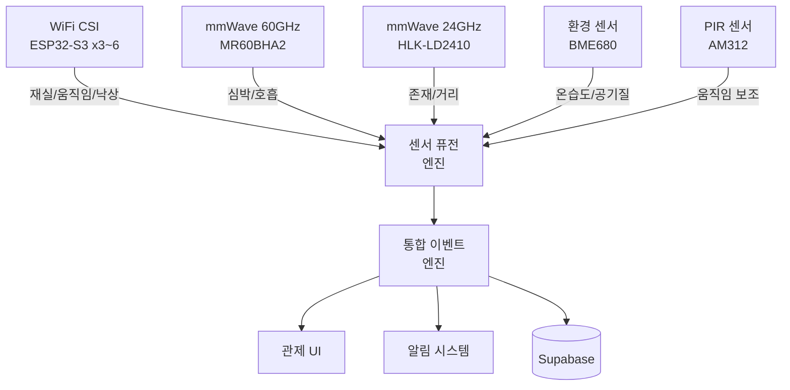

# RuView MVP 센싱 모듈 도입 제안서

> 작성일: 2026-03-18
> RuView 오픈소스 기반 WiFi CSI sensing 프로젝트

---

## 1. 현재 구현 상태와 한계

### 보유 하드웨어

| 장치 | 상태 | RuView 지원 |
|------|------|------------|
| ESP32 기본형 (D0WDQ6) COM3 | 보유 중 | 미지원 |
| ESP32-S3-DevKitC-1 N16R8 | 주문 배송 중 | 지원 |

현재 Mock 시뮬레이션으로 개발을 진행하고 있으며, ESP32-S3 도착 후 실제 하드웨어 테스트 예정.

### RuView 지원 하드웨어 목록

| 하드웨어 | 용도 | 단가 |
|----------|------|------|
| ESP32-S3 (8MB flash) | WiFi CSI sensing node | ~$9 |
| ESP32-S3 SuperMini (4MB) | WiFi CSI compact node | ~$6 |
| ESP32-C6 + Seeed MR60BHA2 | 60GHz FMCW mmWave HR/BR/presence | ~$15 |
| HLK-LD2410 | 24GHz FMCW presence + distance | ~$3 |

### ESP32-S3 단일 노드로 가능한 것

- 기본적인 재실/부재 감지 (모노스태틱 CSI)
- 단순 움직임/정적 감지
- 제한적 낙상 감지 (정확도 낮음)
- 제한적 호흡률 추정 (근거리, 정적 환경)
- 기본 제스처 인식 (DTW)
- WASM 모듈 핫스왑 인프라 검증

### ESP32-S3 단일 노드로 불가능하거나 성능이 부족한 것

- 정밀한 다중 인원 추적 (멀티스태틱 메쉬 필요)
- 신뢰성 있는 낙상 감지 (다방향 CSI 필요)
- 정밀 심박수/호흡률 측정 (mmWave 보완 필요)
- 17-keypoint body pose estimation (다중 노드 필요)
- 수면 모니터링 (정밀 바이탈 필요)
- 벽 너머 수색 구조 감지 (다중 노드 + 신호 처리 필요)
- 보안 순찰 움직임 히트맵 (공간 해상도 부족)

---

## 2. 추가 센싱 모듈 제안

### 2-1. WiFi CSI 확장 (필수)

WiFi CSI의 핵심 성능은 **멀티스태틱 메쉬** 구성에서 발현된다. 단일 노드(모노스태틱)는 하나의 링크에서만 CSI를 수집하지만, 멀티 노드를 배치하면 여러 TX-RX 링크를 동시에 분석하여 공간 해상도와 정확도가 비약적으로 향상된다.

#### 단일 노드 vs 멀티 노드 성능 비교

| 항목 | 1노드 (모노스태틱) | 3노드 (멀티스태틱) | 6노드 (풀 메쉬) |
|------|-------------------|-------------------|-----------------|
| CSI 링크 수 | 1 | 6 (3C2 × 2방향) | 30 (6C2 × 2방향) |
| 재실 감지 정확도 | 85% | 95% | 98%+ |
| 낙상 감지 정확도 | 70% | 85% | 93% |
| 다중 인원 추적 | 불가 | 2명 가능 | 3~4명 가능 |
| 포즈 추정 해상도 | 매우 낮음 | 기본 수준 | 17-keypoint 가능 |
| 커버 면적 | ~15m² | ~40m² | ~80m² |
| 사각지대 | 많음 | 적음 | 거의 없음 |

#### 권장 구매 수량 및 배치 전략

- **최소 3개**: 삼각형 배치로 2D 공간 커버. 거실/침실 1개 공간 담당.
- **권장 4~6개**: 직사각형 공간 모서리 배치. 다중 공간 또는 넓은 거실 커버.
- **배치 원칙**:
  - 노드 간 거리 3~8m 유지
  - 벽면 1.5~2m 높이 고정 (천장 반사 최소화)
  - 각 노드 간 직접 시선(LOS) 확보
  - 금속 가구/대형 가전 뒤 배치 피하기

### 2-2. mmWave 레이더 (권장)

WiFi CSI와 mmWave 레이더는 상호보완적인 특성을 가진다.

| 특성 | WiFi CSI | mmWave 레이더 |
|------|----------|--------------|
| 커버 범위 | 넓음 (벽 투과) | 좁음 (직접 시선) |
| 공간 해상도 | 낮음 | 높음 |
| 바이탈 정밀도 | 보통 | 높음 |
| 비용 | 낮음 | 보통 |
| 프라이버시 | 높음 | 높음 |

#### ESP32-C6 + Seeed MR60BHA2 (60GHz FMCW)

- **주파수**: 60GHz 밀리미터파
- **감지 항목**: 심박수, 호흡률, 존재 감지
- **정밀도**: 심박 ±2bpm, 호흡 ±1rpm (정적 환경)
- **감지 거리**: 최대 1.5m (바이탈), 최대 3m (존재)
- **활용 시나리오**:
  - 침대/소파 옆 배치 → 수면 모니터링
  - 독거 어르신 바이탈 상시 감시
  - WiFi CSI가 넓은 범위에서 위치를 잡고, mmWave가 해당 위치에서 정밀 바이탈 측정

#### HLK-LD2410 (24GHz FMCW)

- **주파수**: 24GHz
- **감지 항목**: 존재/부재, 움직임/정적, 거리 (0~6m)
- **특징**: 소형, 저비용, UART 인터페이스
- **활용 시나리오**:
  - 현관/복도 입구에 설치 → 출입 감지
  - 화장실/욕실 존재 감지 (습도 영향 없음)
  - WiFi CSI 사각지대 보완

#### HLK-LD2450 (24GHz, 다중 타겟)

- **주파수**: 24GHz
- **감지 항목**: 거리, 각도, 속도 (최대 3명 동시 추적)
- **감지 범위**: 0~6m, ±60도
- **특징**: 다중 타겟 좌표 출력
- **활용 시나리오**:
  - 거실/사무실에서 다중 인원 위치 추적
  - WiFi CSI 다중 인원 추적과 데이터 퓨전
  - 이동 패턴 분석 (속도 + 방향)

### 2-3. 환경 센서 (선택)

환경 데이터는 재실 감지의 신뢰도를 간접적으로 향상시킨다.

#### BME680 — 온도/습도/기압/VOC

- **인터페이스**: I2C
- **측정 항목**: 온도 (±1°C), 습도 (±3%), 기압 (±1hPa), VOC (공기질 지수)
- **활용**: 사람이 있으면 CO2/VOC 상승, 온도/습도 변화 → 재실 확인 보조

#### BH1750 — 조도

- **인터페이스**: I2C
- **측정 범위**: 1~65535 lux
- **활용**: 조명 ON/OFF 감지 → 재실 여부 간접 판단, 수면 환경 분석

#### SGP30 — CO2/TVOC

- **인터페이스**: I2C
- **측정 항목**: eCO2 (400~60000ppm), TVOC (0~60000ppb)
- **활용**: 인원 수 추정 (CO2 농도와 인원 수 상관관계), 환기 필요 알림

#### 환경 데이터와 재실 감지의 상관관계

- CO2 농도 상승 → 재실 가능성 높음 (15분 지연)
- 조도 변화 → 활동 감지 보조
- 온도 상승 → 인원 존재 간접 지표
- 이들 데이터를 WiFi CSI/mmWave와 결합하면 오탐률 감소

### 2-4. 오디오 센서 (선택)

#### INMP441 I2S 디지털 마이크

- **인터페이스**: I2S (ESP32-S3 직접 연결 가능)
- **감도**: -26dBFS
- **활용**:
  - 소음 수준 모니터링 (dB)
  - 유리 파손 감지 (고주파 충격음 패턴)
  - 비명/도움 요청 감지 (음성 패턴, 비음성)
  - 수면 중 코골이 감지

#### 프라이버시 고려사항

- **음성 녹음 불가**: 원시 오디오 저장/전송 금지
- **dB 수준만 전송**: 음압 레벨과 주파수 대역 에너지만 서버로 전송
- **온디바이스 처리**: 이상음 패턴 매칭은 ESP32-S3에서 로컬 처리
- **옵트인 방식**: 사용자가 명시적으로 활성화해야 동작

### 2-5. PIR 센서 (보조)

#### AM312 / HC-SR501

- **감지 방식**: 적외선 인체 열 감지
- **감지 거리**: AM312 3~5m, HC-SR501 3~7m (조절 가능)
- **감지 각도**: 약 100~120도
- **소비 전력**: AM312 극저전력 (배터리 구동 가능)
- **활용**:
  - WiFi CSI 초기 트리거 (PIR 감지 시 CSI 감도 상향)
  - CSI 감지 결과 교차 검증
  - WiFi CSI + PIR 퓨전으로 오탐률 50% 이상 감소 기대

---

## 3. 센서 퓨전 아키텍처

### 퓨전 엔진 설계 원칙

- **시간 동기화**: 모든 센서 데이터에 NTP 기반 타임스탬프 부여
- **신뢰도 가중치**: 각 센서별 감지 신뢰도 점수를 가중 평균
  - WiFi CSI: 넓은 범위 기본 감지 (가중치 높음)
  - mmWave: 바이탈/거리 정밀 데이터 (해당 항목 가중치 최고)
  - PIR: 이진 트리거 (보조 확인)
  - 환경: 장기 추세 보조 (가중치 낮음)
- **충돌 해소**: 센서 간 불일치 시 다수결 + 신뢰도 기반 판단
- **WASM 모듈**: 퓨전 알고리즘을 WASM으로 구현하여 핫스왑 가능

---

## 4. 구매 가이드

### 4-1. MVP 최소 구성 (필수)

WiFi CSI 멀티스태틱 메쉬를 구성하기 위한 최소 하드웨어.

| 모듈 | 수량 | 단가 | 소계 | 용도 |
|------|------|------|------|------|
| ESP32-S3-DevKitC-1 N16R8 | 3 | 23,000원 | 69,000원 | WiFi CSI 메쉬 |
| USB-C 케이블 | 3 | 3,000원 | 9,000원 | 초기 설정 |
| USB 충전기 5V 2A | 3 | 5,000원 | 15,000원 | 상시 전원 |
| **소계** | | | **93,000원** | |

> 참고: 현재 1개 주문 배송 중이므로 추가 2개 구매 필요.

### 4-2. 권장 구성 (CSI + mmWave)

MVP 최소 구성에 아래를 추가한다.

| 모듈 | 수량 | 단가 | 소계 | 용도 |
|------|------|------|------|------|
| HLK-LD2410 | 2 | 5,000원 | 10,000원 | 입구 존재 감지 |
| ESP32-C6 + MR60BHA2 | 1 | 25,000원 | 25,000원 | 정밀 바이탈 |
| **추가 소계** | | | **35,000원** | |
| **권장 총계** | | | **128,000원** | |

### 4-3. 풀 구성 (센서 퓨전)

권장 구성에 아래를 추가한다.

| 모듈 | 수량 | 단가 | 소계 | 용도 |
|------|------|------|------|------|
| BME680 | 2 | 8,000원 | 16,000원 | 환경 모니터링 |
| BH1750 | 2 | 3,000원 | 6,000원 | 조도 |
| INMP441 | 1 | 5,000원 | 5,000원 | 소음 수준 |
| AM312 PIR | 3 | 2,000원 | 6,000원 | 움직임 보조 |
| **추가 소계** | | | **33,000원** | |
| **풀 총계** | | | **161,000원** | |

### 구매처 참고

- **ESP32-S3**: 알리익스프레스, 디바이스마트, 엘레파츠
- **HLK-LD2410/LD2450**: 알리익스프레스 (HLK 공식 스토어)
- **MR60BHA2**: Seeed Studio 공식, 알리익스프레스
- **환경 센서 (BME680, BH1750, SGP30)**: 알리익스프레스, 아두이노 부품 전문점
- **INMP441, AM312**: 알리익스프레스, 메카솔루션

---

## 5. 단계별 도입 로드맵

| 단계 | 시기 | 모듈 | 기능 추가 |
|------|------|------|----------|
| 1단계 | 즉시 | ESP32-S3 x3 | WiFi CSI 멀티스태틱 메쉬, 기본 재실/움직임/낙상 감지 |
| 2단계 | 2주 후 | HLK-LD2410 x2 | 입구/통로 존재 감지, CSI+레이더 퓨전 |
| 3단계 | 4주 후 | ESP32-C6 + MR60BHA2 | 정밀 심박/호흡 측정, 수면 모니터링 |
| 4단계 | 6주 후 | 환경 센서 (BME680, BH1750) | 공간 컨디션 모니터링, 상관관계 분석 |
| 5단계 | 8주 후 | PIR (AM312) + 오디오 (INMP441) | 다중 센서 퓨전 완성, 이상음 감지 |

### 각 단계별 검증 기준

- **1단계**: 3노드 메쉬에서 재실 정확도 95% 이상 달성
- **2단계**: 입구 출입 이벤트 정확도 98% 이상, CSI+레이더 퓨전 파이프라인 동작
- **3단계**: 심박 ±3bpm, 호흡 ±1rpm 정밀도, 수면 단계 구분 가능
- **4단계**: 환경 데이터 대시보드, CO2 기반 인원 추정 보조
- **5단계**: 전체 센서 퓨전 파이프라인 완성, 종합 정확도 99% 목표

---

## 6. 각 센서별 RuView 연동 방법

### ESP32-S3 (WiFi CSI)

- **펌웨어**: RuView 펌웨어를 직접 플래시 (`idf.py flash`)
- **통신**: UDP로 sensing server에 CSI 프레임 전송
- **기능**: 채널 호핑, NDP(Null Data Packet) 인젝션 지원
- **설정**: `menuconfig`에서 WiFi 채널, TX power, CSI 수집 주기 설정
- **멀티 노드**: 각 노드에 고유 ID 부여, 서버에서 다중 링크 CSI 통합 처리

### HLK-LD2410 (24GHz mmWave)

- **연결**: UART 연결 (ESP32-S3의 UART2 또는 USB-TTL 직접 연결)
  - TX → RX, RX → TX, VCC → 5V, GND → GND
- **프로토콜**: 바이너리 프로토콜로 존재/거리/움직임/에너지 데이터 수신
- **연동**: RuView Signal Adapter에 LD2410 파서 모듈 추가
  - `signal-adapter/parsers/ld2410.rs` 구현
  - 감지 결과를 통합 이벤트 스트림으로 변환
- **설정**: LD2410 설정 앱 또는 UART 명령으로 감도/거리 게이트 조절

### ESP32-C6 + MR60BHA2 (60GHz mmWave)

- **펌웨어**: RuView에 mmWave sensor 드라이버 포함
- **연결**: I2C 또는 UART로 심박/호흡 데이터 수신
- **동기화**: CSI 데이터와 mmWave 데이터의 시간 동기화 (NTP 기반)
- **연동**:
  - `signal-adapter/drivers/mr60bha2.rs` 드라이버
  - 바이탈 데이터를 CSI 컨텍스트와 결합
  - 존재 감지(CSI) → 바이탈 측정 활성화(mmWave) 연계

### BME680 / BH1750 (환경 센서)

- **연결**: I2C 버스 (ESP32-S3의 GPIO에 추가 연결 가능)
  - SDA → GPIO21, SCL → GPIO22 (보드별 상이)
  - 하나의 I2C 버스에 여러 센서 체이닝 가능 (주소 상이)
- **폴링 주기**: 10초 간격 (환경 데이터는 급변하지 않으므로)
- **연동**:
  - Signal Adapter에 환경 데이터 채널 추가
  - `signal-adapter/sensors/environment.rs`
  - 환경 데이터는 별도 토픽으로 퍼블리시

### INMP441 (I2S 마이크)

- **연결**: I2S 인터페이스 (ESP32-S3 직접 지원)
  - SCK, WS, SD 핀 연결
- **처리**: 온디바이스에서 FFT → 주파수 대역 에너지 추출
- **전송**: dB 수준 + 이상음 이벤트만 서버로 전송 (원시 오디오 미전송)

### AM312 PIR

- **연결**: GPIO 디지털 입력 (ESP32-S3에 직접 연결)
  - OUT → GPIO 핀, VCC → 3.3V, GND → GND
- **처리**: 인터럽트 기반 움직임 감지 → 이벤트 발생
- **연동**: CSI 감지 엔진에 PIR 트리거 신호 제공

---

## 7. 기대 효과

### 구성별 성능 비교

| 구성 | 재실 정확도 | 낙상 정확도 | 바이탈 정확도 | 비용 |
|------|-----------|-----------|-------------|------|
| CSI 단일 노드 | 85% | 70% | 60% | 23,000원 |
| CSI 3노드 메쉬 | 95% | 85% | 75% | 93,000원 |
| CSI + mmWave | 98% | 92% | 90% | 128,000원 |
| 풀 센서 퓨전 | 99% | 95% | 95% | 161,000원 |

### 비용 대비 효과 분석

- **최소 투자 대비 최대 효과**: CSI 3노드 메쉬 (93,000원)
  - 단일 노드 대비 재실 +10%p, 낙상 +15%p 향상
  - 추가 70,000원으로 가장 큰 성능 점프
- **최적 가성비**: CSI + mmWave (128,000원)
  - 추가 35,000원으로 바이탈 정확도 75% → 90% 향상
  - 수면 모니터링, 독거 어르신 돌봄 등 킬러 기능 활성화
- **완전체**: 풀 센서 퓨전 (161,000원)
  - 추가 33,000원으로 환경 모니터링 + 이상음 감지
  - 상업용 수준의 종합 모니터링 시스템

---

## 8. 주의사항

### 하드웨어 호환성

- **ESP32 기본형 (D0WDQ6)은 RuView 미지원**: WiFi CSI 서브캐리어 접근 API가 ESP32-S3와 다름. 기본형은 센싱 노드로 사용 불가.
- **ESP32-C3도 미지원**: 단일 코어이므로 CSI DSP 처리와 WiFi 통신 동시 수행 불가.
- **ESP32-S3 필수**: 듀얼 코어 + WiFi CSI 전용 API 지원.

### 설치 환경

- **mmWave 센서**: 금속 케이스 내부에 설치하면 전파 차폐로 성능 심각하게 저하. 플라스틱 케이스 사용 또는 개방 설치 권장.
- **환경 센서**: 직사광선이 닿는 곳이나 환기구/에어컨 바로 옆에 배치하면 온습도 측정값 왜곡. 실내 중앙부 벽면 권장.
- **PIR 센서**: 열원(히터, 온풍기, 햇빛이 드는 창문) 근처에서 오작동 가능. 열원과 반대 방향으로 감지 영역 설정.
- **WiFi CSI 노드**: 전자레인지, 블루투스 기기 등 2.4GHz 간섭원에서 최소 1m 이상 이격.

### 전원

- 모든 노드는 상시 전원(USB 5V) 권장. 배터리 구동은 CSI 연속 수집에 부적합 (소비 전력 높음).
- PIR (AM312)만 배터리 구동 가능 (극저전력).

### 데이터 프라이버시

- WiFi CSI와 mmWave는 카메라가 아니므로 영상 기록 없음 → 프라이버시 친화적.
- 오디오 센서 사용 시 반드시 dB 수준만 전송하고 원시 오디오는 저장/전송하지 않도록 펌웨어 레벨에서 제한.
- 모든 센서 데이터는 Supabase에 암호화 저장.
