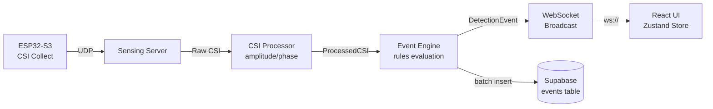
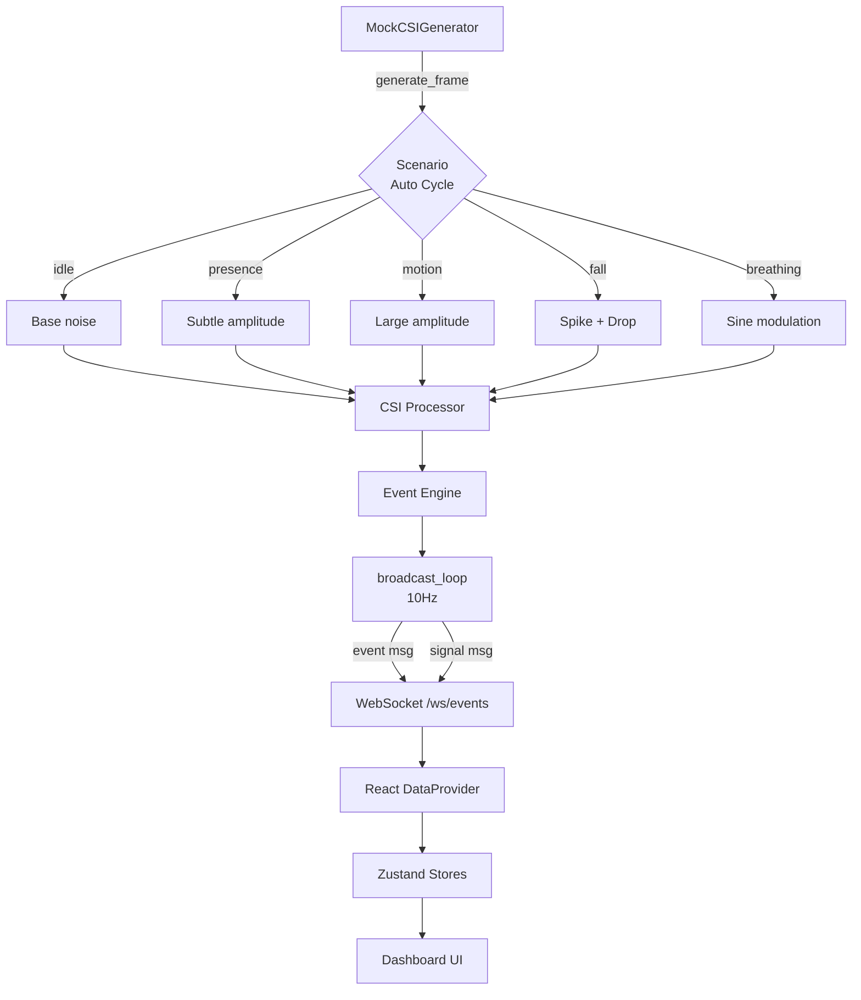
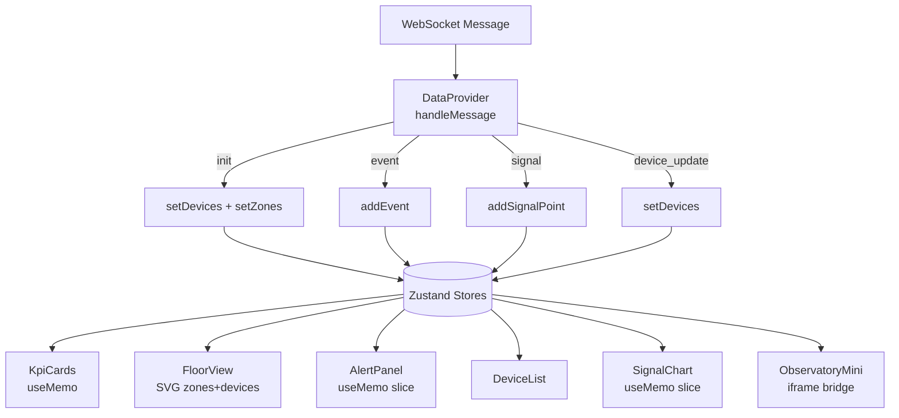
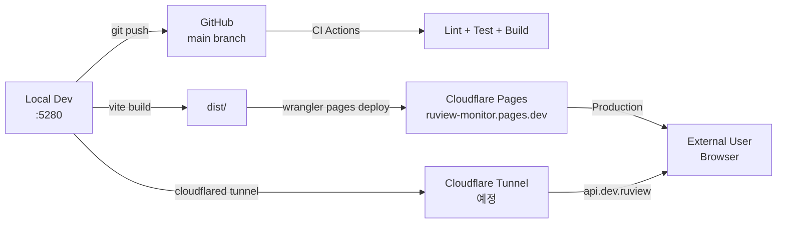
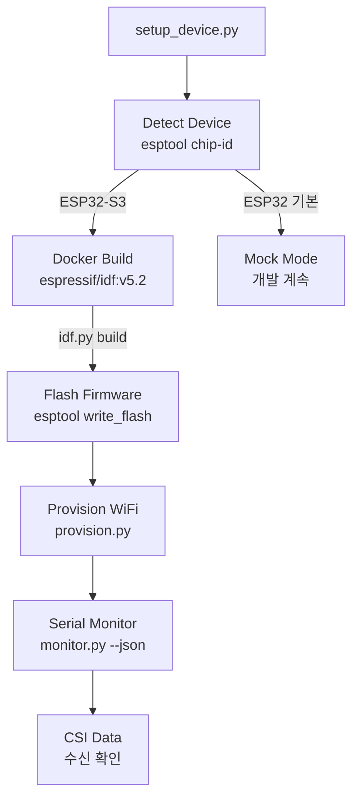
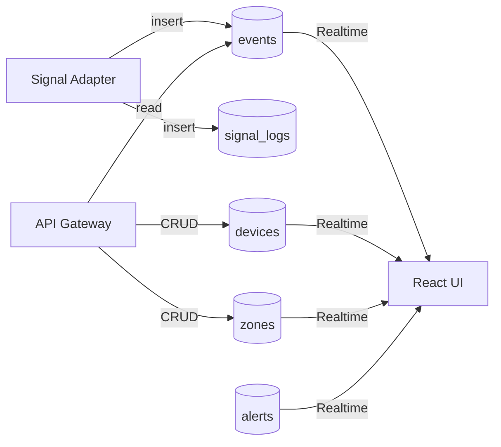
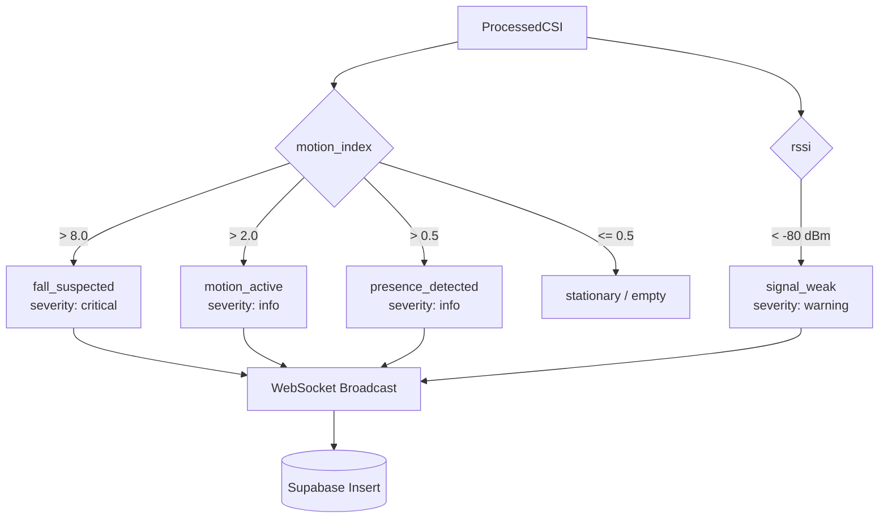

# ruView 시스템 아키텍처 문서

> **프로젝트**: ruView — Wi-Fi CSI 기반 비접촉 재실 감지 모니터링 시스템
> **작성일**: 2026-03-18
> **버전**: v0.1.0-alpha (MVP)

---

## 1. 서버 인프라 구성도

```
┌──────────────────────────────────────────────────────────────────────────────┐
│                     로컬 개발 머신  (Windows 11 Pro)                         │
│                                                                              │
│  ┌─────────────────┐   ┌──────────────────────┐   ┌──────────────────────┐  │
│  │   ESP32 (COM3)  │   │  Mock CSI Server     │   │   API Gateway        │  │
│  │   D0WDQ6 기본형 │   │  FastAPI :8001   ✅  │   │   FastAPI :8000      │  │
│  │                 │   │  WS /ws/events       │   │   REST + WS          │  │
│  │  ※ ESP32-S3     │   │  10Hz broadcast      │   │   (대기)             │  │
│  │    주문 배송 중  │   └──────────────────────┘   └──────────────────────┘  │
│  └─────────────────┘                                                         │
│                                                                              │
│  ┌──────────────────────┐   ┌──────────────────────────────────────────────┐ │
│  │  React Dev Server    │   │  .env 시크릿 관리                            │ │
│  │  Vite :5280      ✅  │   │  ├─ GITHUB_TOKEN                            │ │
│  │  HMR + Proxy         │   │  ├─ SUPABASE_URL / SUPABASE_ANON_KEY        │ │
│  └──────────────────────┘   │  ├─ CLOUDFLARE_API_TOKEN / ACCOUNT_ID       │ │
│                              │  ├─ WIFI_SSID / WIFI_PASSWORD               │ │
│  ┌──────────────────────┐   │  └─ ESP_PORT / ESP_BAUD                     │ │
│  │  Git Repository      │   └──────────────────────────────────────────────┘ │
│  │  D:/home/ruView      │                                                    │
│  │  main + develop      │                                                    │
│  │  7 commits           │                                                    │
│  └──────────────────────┘                                                    │
└──────────────────────────────────────────────────────────────────────────────┘
          │                          │                         │
          │ git push                 │ wrangler deploy         │ cloudflared
          ▼                          ▼                         ▼
┌──────────────────────────────────────────────────────────────────────────────┐
│                           외부 클라우드 서비스                                │
│                                                                              │
│  ┌──────────────────────┐   ┌──────────────────────┐                        │
│  │  GitHub              │   │  Cloudflare Pages     │                        │
│  │  softj2019/          │   │  ruview-monitor       │                        │
│  │   ruview-mvp         │   │   .pages.dev      ✅  │                        │
│  │  CI/CD Actions       │   │  Production 배포      │                        │
│  │  21 labels           │   └──────────────────────┘                        │
│  │  6 milestones        │                                                    │
│  └──────────────────────┘   ┌──────────────────────┐                        │
│                              │  Supabase Cloud       │                        │
│  ┌──────────────────────┐   │  wlpmijeqtrfpig...   │                        │
│  │  Cloudflare Tunnel   │   │  5 tables, RLS    ✅  │                        │
│  │  (미설치, 예정)      │   │  Realtime 활성화  ✅  │                        │
│  └──────────────────────┘   └──────────────────────┘                        │
└──────────────────────────────────────────────────────────────────────────────┘
```

---

## 2. 소프트웨어 아키텍처 구성도

```
┌─────────────────────────────────────────────────────────────────────────────┐
│  LAYER 4: Frontend Layer  (React 19 + Vite + TypeScript)                    │
│                                                                             │
│  ┌─── Pages ──────────────┐  ┌─── Components ────────────────────────────┐ │
│  │  Dashboard             │  │  KpiCards          AlertPanel             │ │
│  │  Devices               │  │  FloorView (SVG 2D)  DeviceList          │ │
│  │  Events                │  │  ObservatoryMini     SignalChart          │ │
│  │  Settings              │  │                                           │ │
│  └────────────────────────┘  └───────────────────────────────────────────┘ │
│                                                                             │
│  ┌─── Stores (Zustand) ──┐  ┌─── Hooks ─────────┐  ┌─── Styles ───────┐ │
│  │  deviceStore           │  │  useWebSocket      │  │  Tailwind CSS    │ │
│  │  zoneStore             │  │   auto-reconnect   │  │  Dark 100%      │ │
│  │  eventStore            │  │   callbacksRef     │  │  Neon accents   │ │
│  │  signalStore           │  │                    │  │                  │ │
│  └────────────────────────┘  └────────────────────┘  └──────────────────┘ │
├─────────────────────────────────────────────────────────────────────────────┤
│  LAYER 3: API Layer  (FastAPI, REST + WebSocket, :8000)                     │
│                                                                             │
│  ┌──────────────────────────────────────────────────────────────────────┐  │
│  │  api-gateway  ──  CRUD endpoints  ──  WebSocket proxy               │  │
│  └──────────────────────────────────────────────────────────────────────┘  │
├─────────────────────────────────────────────────────────────────────────────┤
│  LAYER 2: Signal Layer  (Python)                                            │
│                                                                             │
│  ┌──────────────┐ ┌──────────────┐ ┌──────────────┐ ┌──────────────────┐ │
│  │ mock_        │ │ csi_         │ │ event_       │ │ mock_server.py   │ │
│  │ generator.py │→│ processor.py │→│ engine.py    │→│ :8001            │ │
│  │ 5 scenarios  │ │ amp / phase  │ │ rules eval   │ │ WS 10Hz         │ │
│  └──────────────┘ └──────────────┘ └──────────────┘ └──────────────────┘ │
├─────────────────────────────────────────────────────────────────────────────┤
│  LAYER 1: ESP32 Layer  (현재 Mock 대체)                                     │
│                                                                             │
│  ┌──────────────┐ ┌──────────────┐ ┌──────────────┐ ┌──────────────────┐ │
│  │ CSI Collect  │ │ UDP Stream   │ │ Wi-Fi STA    │ │ Channel Hop      │ │
│  │              │ │              │ │ Connection   │ │ Scanning         │ │
│  └──────────────┘ └──────────────┘ └──────────────┘ └──────────────────┘ │
└─────────────────────────────────────────────────────────────────────────────┘
```

---

## 3. 데이터 흐름도

```
┌──────────┐    ┌───────────────┐    ┌───────────────┐    ┌──────────────┐
│  ESP32   │───→│ Mock          │───→│ CSI           │───→│ Event        │
│  (CSI)   │    │ Generator     │    │ Processor     │    │ Engine       │
└──────────┘    │ 5 scenarios   │    │ amplitude     │    │ rules eval   │
                │ auto-cycle    │    │ phase extract │    │ threshold    │
                └───────────────┘    └───────────────┘    └──────┬───────┘
                                                                  │
                                          ┌───────────────────────┼──────────┐
                                          │                       │          │
                                          ▼                       ▼          │
                                   ┌──────────────┐    ┌──────────────┐     │
                                   │ Mock Server  │    │ Supabase     │     │
                                   │ WS broadcast │    │ events       │     │
                                   │ 10Hz         │    │ signal_logs  │     │
                                   └──────┬───────┘    │ batch insert │     │
                                          │            └──────────────┘     │
                                          │ ws://localhost:8001              │
                                          ▼                                  │
                                   ┌──────────────────────────────────┐     │
                                   │         React UI                  │     │
                                   │                                   │     │
                                   │  ┌────────────┐  ┌────────────┐  │     │
                                   │  │ Zustand    │→ │ Components │  │     │
                                   │  │ Stores     │  │ (re-render)│  │     │
                                   │  └────────────┘  └────────────┘  │     │
                                   └──────────────────────────────────┘     │
```

---

## 4. 에이전트 구성도

```
                    ┌──────────────────────────────────────┐
                    │  PM / Architect                       │
                    │  Claude Code Opus 4.6                 │
                    │  전체 설계, 태스크 분배, 품질 관리     │
                    └───────────────────┬──────────────────┘
                                        │
            ┌───────────┬───────────┬───┴───┬───────────┬───────────┐
            ▼           ▼           ▼       ▼           ▼           ▼
   ┌──────────────┐ ┌──────────┐ ┌──────────┐ ┌──────────┐ ┌──────────┐ ┌──────────┐
   │ Agent A      │ │ Agent B  │ │ Agent C  │ │ Agent D  │ │ Agent E  │ │ Agent F  │
   │ Hardware/    │ │ Signal/  │ │ Frontend/│ │ 3D       │ │ DevOps/  │ │ QA/      │
   │ Edge         │ │ Python   │ │ 2D       │ │ Observ.  │ │ Repo     │ │ Demo     │
   ├──────────────┤ ├──────────┤ ├──────────┤ ├──────────┤ ├──────────┤ ├──────────┤
   │ ESP32 flash  │ │ CSI proc │ │ React    │ │ iframe   │ │ GitHub   │ │ 데모     │
   │ Wi-Fi        │ │ event    │ │ shell    │ │ bridge   │ │ CI/CD    │ │ 시나리오 │
   │ provision    │ │ engine   │ │ floor    │ │ R3F      │ │ CF Pages │ │ 스크린샷 │
   │              │ │ mock svr │ │ 4 pages  │ │          │ │ Supabase │ │          │
   ├──────────────┤ ├──────────┤ ├──────────┤ ├──────────┤ ├──────────┤ ├──────────┤
   │ Status:      │ │ Status:  │ │ Status:  │ │ Status:  │ │ Status:  │ │ Status:  │
   │ ⏳ 대기     │ │ ✅ Done  │ │ ✅ Done  │ │ 📋 계획 │ │ 🔧 진행 │ │ 📋 계획 │
   └──────────────┘ └──────────┘ └──────────┘ └──────────┘ └──────────┘ └──────────┘
```

---

## 5. 모노레포 디렉토리 구조

```
D:/home/ruView/
├── .env                              # 시크릿 (git-ignored)
├── .gitignore                        # ✅
├── package.json                      # 루트 워크스페이스
├── README.md                         # 프로젝트 개요
│
├── frontend/                         # React 19 + Vite + TypeScript
│   ├── package.json                  # ✅
│   ├── vite.config.ts                # dev :5280, proxy 설정
│   ├── tsconfig.json                 # ✅
│   ├── tailwind.config.js            # 다크 모드, neon 색상
│   ├── index.html                    # ✅ 엔트리
│   ├── public/                       # 정적 자산
│   └── src/
│       ├── main.tsx                  # ✅ 앱 진입점
│       ├── App.tsx                   # ✅ 라우팅 + DataProvider
│       ├── pages/
│       │   ├── Dashboard.tsx         # ✅ 메인 대시보드
│       │   ├── Devices.tsx           # ✅ 디바이스 관리
│       │   ├── Events.tsx            # ✅ 이벤트 로그
│       │   └── Settings.tsx          # ✅ 설정
│       ├── components/
│       │   ├── KpiCards.tsx           # ✅ 핵심 지표 카드
│       │   ├── FloorView.tsx         # ✅ SVG 2D 평면도
│       │   ├── ObservatoryMini.tsx    # ✅ 3D 미니 뷰 (iframe)
│       │   ├── AlertPanel.tsx         # ✅ 알림 패널
│       │   ├── DeviceList.tsx         # ✅ 디바이스 목록
│       │   └── SignalChart.tsx        # ✅ 신호 차트
│       ├── stores/
│       │   ├── deviceStore.ts         # ✅ Zustand
│       │   ├── zoneStore.ts           # ✅ Zustand
│       │   ├── eventStore.ts          # ✅ Zustand
│       │   └── signalStore.ts         # ✅ Zustand
│       ├── hooks/
│       │   └── useWebSocket.ts        # ✅ auto-reconnect
│       ├── providers/
│       │   └── DataProvider.tsx        # ✅ WS 메시지 분배
│       └── types/
│           └── index.ts               # ✅ 공유 타입
│
├── signal-server/                     # Python 신호 처리
│   ├── requirements.txt               # ✅
│   ├── mock_generator.py              # ✅ 5 시나리오 생성기
│   ├── csi_processor.py               # ✅ CSI 데이터 처리
│   ├── event_engine.py                # ✅ 이벤트 감지 엔진
│   └── mock_server.py                 # ✅ FastAPI :8001 WS
│
├── api-gateway/                       # API 서버 (대기)
│   └── main.py                        # FastAPI :8000
│
├── esp32/                             # ESP32 펌웨어 (대기)
│   ├── firmware/                      # ESP-IDF 소스
│   └── tools/
│       ├── setup_device.py            # 디바이스 설정 스크립트
│       ├── provision.py               # Wi-Fi 프로비저닝
│       └── monitor.py                 # 시리얼 모니터
│
├── supabase/                          # Supabase 설정
│   └── migrations/                    # SQL 마이그레이션
│       └── 001_initial.sql            # ✅ 5 테이블 스키마
│
├── docs/                              # 문서
│   └── architecture/
│       └── system-architecture.md     # 본 문서
│
├── .github/
│   └── workflows/                     # CI/CD
│       └── deploy.yml                 # ✅ CF Pages 배포
│
└── scripts/                           # 유틸리티 스크립트
    └── deploy.sh                      # 수동 배포 스크립트
```

---

## 6. 주요 기능별 워크플로우

### 6-1. CSI 데이터 수집 워크플로우



### 6-2. Mock 시뮬레이션 워크플로우



### 6-3. 프론트엔드 렌더링 워크플로우



### 6-4. 배포 워크플로우



### 6-5. ESP32-S3 디바이스 설정 워크플로우



### 6-6. Supabase 데이터 흐름 워크플로우



### 6-7. 이벤트 감지 규칙 워크플로우



---

> **Note**: 본 문서는 MVP 단계의 아키텍처를 기술하며, 프로젝트 진행에 따라 지속 업데이트됩니다.
